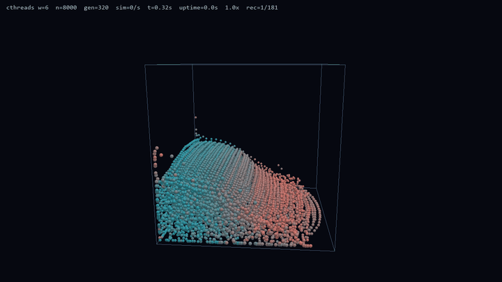
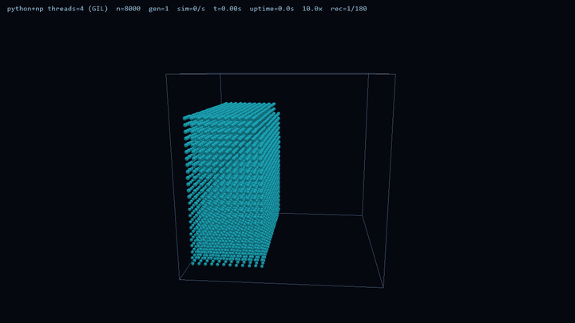

[](https://colab.research.google.com/github/K-T0BIAS/CThreads/blob/main/colab/Mandelbrot.ipynb)

----

**cthreads** compiles a typed Python subset into **native kernels**: CPU via C++ (`@Thread` / `@Threadable`), optional GPU via Vulkan (`@Gpu`). You keep Python-shaped control flow (jobs, pools, sync, `await`) while the heavy work runs as **OS-native / on-device compute** in the background.

GPU support ships as **`cthreads-gpu`** (same `import cthreads`; do not install it alongside the CPU-only `cthreads` wheel). The type whitelist covers scalars, containers, and your own Threadable types.

## Why cthreads

Hand-written C++/GLSL (or a full pybind project) is powerful but leaves the Python loop. `threading` stays on the GIL for CPU-bound bytecode; `multiprocessing` gets multi-core but pays process boundaries and pickling. cthreads sits in between: **annotate -> compile -> run** with the same job/pool/sync feel on CPU, and the same idea on GPU through `cthreads-gpu`.

It is a typed subset (not full Python). It is not a drop-in NumPy replacement. Prefer it when you want compiled native kernels without leaving a Python-shaped API.

| cthreads SPH | Python + NumPy SPH |
|:---:|:---:|
| realtime | linear speedup up to **100x realtime** on this scene |
|  |  |

**Fig. 1.** Side-by-side Smoothed Particle Hydrodynamics (SPH) fluid demo under identical scene setup (same particle set, forces, timestep, and camera).
**Left:** dynamics advanced with **cthreads** (`@Thread` kernels on a `ThreadPool`, shared native buffers). **Right:** the same solver expressed as **Python + NumPy** array kernels on the host. Overlay text at the top of each clip reports live run metrics; the **second-to-last** value is **realtime speedup** (simulated time per unit wall-clock). On this scene the NumPy path reaches up to about **100x realtime**; the cthreads path is shown for visual parity of the fluid, not as a matched FPS bake-off in the GIF encode.

---

Interactive CPU Mandelbrot (pool + Shared + TBuffer):
[Open in Colab](https://colab.research.google.com/github/K-T0BIAS/CThreads/blob/main/colab/Mandelbrot.ipynb).

----

### Docs

- [Install](./docs/install.md)
- [FAQ](./docs/FAQ.md)
- [CPU quickstart](./docs/quickstart.md) (reading map + basics)
- [GPU quickstart](./docs/guide/gpu/quickstart.md)
- [Guides catalog](./docs/index.md)
- [API reference](./docs/API.md)

----

# Install

**Python >= 3.10**, a **C++17** compiler, and **CMake >= 3.18** (CMake is only needed to build the native `_ext` module). Full toolchain notes: [docs/install.md](./docs/install.md).

### From PyPI

Published wheels (Linux / Windows x86_64) and the sdist are on [PyPI](https://pypi.org/project/cthreads/):

```bash
pip install cthreads
# Vulkan GPU (@Gpu) support (full package; do not install alongside cthreads):
pip install cthreads-gpu
```

You still need a C++ compiler for the first `thread(...)` (user kernels). On Linux, wheels include a prebuilt `_ext`; CMake is only required if you install from the sdist or develop from source.

### From this repo (editable)

```bash
python -m venv .venv
# activate, then:
pip install cmake ninja    # CMake/Ninja in the venv; compiler is still system/MSVC
pip install -e ".[test]"   # or: pip install -e .
```

First `cthreads.thread(...)` auto-runs cache-checked `prepare` + `load_kernels`. Call `unload_kernels()` before a force rebuild (`thread(..., force=True)` or `prepare(force=True)`).

----

# Introduction

Annotate what should become a native kernel:

- **`@Thread`** - functions / methods compiled to C++
- **`@Threadable`** - classes compiled to C++ structs (shared state across kernels)
- **`@Gpu`** - functions compiled to Vulkan compute (lists of scalars; see [GPU guides](./docs/guide/gpu/README.md))

## Supported types

Allowed in annotations (arguments, returns, locals, Threadable fields):

* `int`, `float`, `bool`, `str`
* `list[...]` of allowed types
* `dict[...]` of allowed types (typically `dict[str, ...]`)
* nested combinations of the above
* [`@Threadable`](#threadable) classes
* any internal types imported by `cthreads`

This is a **whitelist**, not full Python. No arbitrary objects, no untyped values in kernels.

## `@Thread`

Marks a function or method for compilation. Pass it to `cthreads.thread(...)` to run off the GIL.

```python
from cthreads import Thread

@Thread
def my_example_function() -> None:
    return
```

### Rules

1. **Typed parameters and a return type** (use `-> None` when there is no value).
2. **No `*args` / `**kwargs`.**
3. **Locals must be annotated** with an allowed type (`x: int = 0`).
4. Inside the body, only call other **`@Thread`** functions/methods, plus supported libraries (`math`, `cthreads.math`, `cthreads.sync`, `cthreads.linalg`) and builtins like `len` / `range`. No arbitrary Python.
5. Return values must match the declared return type.

```python
from cthreads import Thread

@Thread
def example_function(scale: float, values: list[float]) -> float:
    total: float = 0.0
    i: int = 0
    while i < len(values):
        total += scale * values[i]
        i += 1
    return total
```

## `@Threadable`

Python's open object model does not map cleanly to C++. `@Threadable` marks a class so the compiler can emit a fixed C++ struct and marshal it safely.

```python
from cthreads import Threadable

@Threadable
class MyExample:
    x: float
    y: float
```

### Rules

1. **All fields are typed** at class scope (dataclass-style annotations).
2. **Do not define / override `__init__`.** The decorator injects a dataclass-style constructor (`ExampleClass(1, "x")` or `ExampleClass(attr1=1)`; omitted fields zero / empty, matching C++ `T{}`).
3. **Kernel methods must use `@Thread`** and take **`self`** like normal methods.
4. Method argument / return annotations must be allowed types (or `-> None`).

```python
from cthreads import Threadable, Thread

@Threadable
class ExampleClass:
    attr1: int
    attr2: str
    attr3: list[float]

    @Thread
    def method1(self) -> None:
        self.attr1 += 1

    @Thread
    def method2(self, string: str) -> str:
        return self.attr2 + string


obj = ExampleClass(0, "1", [2.0, 3.0])

obj.method1()
print(obj.attr1, obj.method2(" 1"))  # 1 1 1
```

**Why Threadables?**

- shared state for worker threads
- typed containers / domain objects
- grouping related kernel methods

----

# Run a `@Thread`

```python
import asyncio
import cthreads
from cthreads import Thread

@Thread
def example_function(lhs: float, rhs: float, count: int) -> float:
    for i in range(count):
        lhs += rhs
    return lhs

# Sync: Job -> join -> result
job = cthreads.thread(example_function, 1.5, 2.0, 200)
job.join()  # starts if needed; blocks this thread (GIL released in C++)
result = job.result()

# Async: await auto-starts and returns the result (event loop stays free)
async def main() -> None:
    job = cthreads.thread(example_function, 1.5, 2.0, 200)
    result = await job
    print(result)

asyncio.run(main())
```

Signature: `cthreads.thread(fn, *args, force: bool = False, **kwargs) -> Job`.

----

# GPU (`@Gpu`, from 0.2.0)

Vulkan compute kernels use the same "annotate then launch" idea on a separate backend:

```python
from cthreads.gpu import Gpu, GlobalIdx, gpu

@Gpu
def saxpy(n: int, a: float, x: list[float], y: list[float]) -> None:
    i: int = GlobalIdx.x
    if i >= n:
        return # do not return None. Simply return
    y[i] = a * x[i] + y[i]

x = [1.0, 2.0, 3.0, 4.0]
y = [10.0, 20.0, 30.0, 40.0]
gpu(saxpy, len(x), 2.0, x, y).join()
```

Full guides (concepts, best practices, examples): [docs/guide/gpu/README.md](./docs/guide/gpu/README.md).
Install / drivers: [docs/install.md](./docs/install.md#gpu-vulkan-compute).

----
