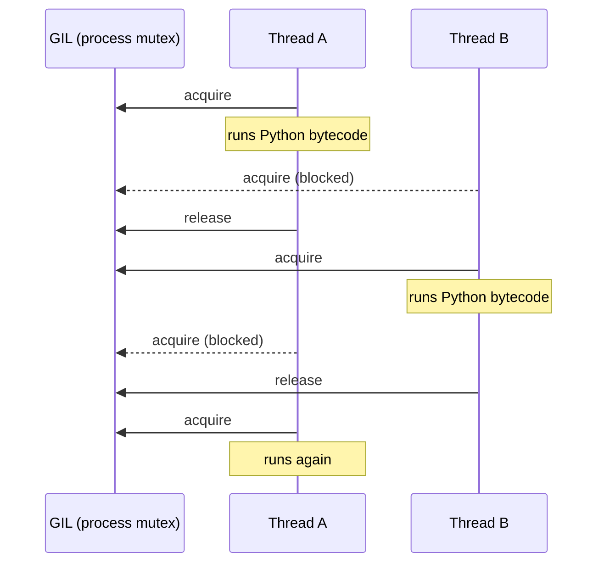

# Multithreading 101 (The basics)

## The GIL

The `GIL` (Global Interpreter Lock) is a per-process shared mutex. When one thread in that process holds it, no other thread can run Python bytecode. Only the thread that owns the GIL is interpreted.

Only one thread runs Python bytecode at a time. Others wait until the holder releases the GIL (for example after a time slice, I/O, or a C extension that drops it):

So two CPU-bound `threading.Thread`s **interleave**. They do not use two cores for Python code at once. (cthreads kernels run **off** the GIL in C++, so they can overlap.)

## Process vs. Thread

In Python, each **process** has its own interpreter and its own `GIL`. That is why `multiprocessing` can run work in **parallel**: workers do not contend for one shared GIL.

The tradeoff is that processes do **not** share memory. Moving data between them means pickling or copying, and coordinating work needs pipes, queues, or shared-memory APIs. That is heavier than threads when you sync often. Starting a process also starts a new interpreter, so **launch time and data copying** dominate when you fire off many small kernels.

Plain `threading` shares memory inside one process, but CPU-bound Python still serializes on that process's GIL (see above). cthreads keeps the shared-memory thread model while running compiled kernels **off** the GIL.

| | Process (`multiprocessing`) | Thread (`threading` / OS thread) |
|---|---|---|
| Memory | Private address space; data must be copied or explicitly shared | Shared address space; objects visible to all threads in the process |
| GIL | One GIL **per process**. Workers do not block each other on one lock | One GIL **per process**. Python bytecode still takes turns |
| CPU-bound Python | Can use multiple cores (separate interpreters) | Does not scale across cores while holding the GIL |
| Startup cost | High (new interpreter + often import + spawn) | Low (cheap OS thread) |
| Data exchange | Serialize / IPC (pickle, queues, pipes) | Direct reads/writes (needs locks for safety) |
| Sync complexity | Heavier IPC primitives | Locks, events, atomics on shared state |
| Best for | Isolating work; bypassing the GIL without native code | Fine-grained concurrency; shared state; I/O wait |
| Weak for | Many tiny jobs; frequent sync; large shared datasets | CPU-bound pure Python |
| cthreads angle | Avoid when you only needed parallelism. Prefer native threads off the GIL | `@Thread` jobs = real threads + C++ kernels, no process tax |

# CThreads

## Overview

cthreads solves Python's threading limit by compiling annotated code to C++ and running it outside the interpreter. The first time you `prepare` / `cthreads.thread(...)`, the backend translates your `@Thread` / `@Threadable` code to C++ and builds a kernel library. Later launches reuse that build with very little overhead. If you change annotated code, the compiler detects it and rebuilds.

Once launched, kernels run on real OS threads, outside the Python event loop and **off the GIL**. When you `join` or `await` a job, results (and mutable arg writeback) are brought back under the GIL automatically.

**Mental model:** Python args are **packed** (copied) into a C++ pack for the kernel. The kernel mutates the pack, not live Python objects. On join / await (and on explicit sync), the pack is written back into the Python objects that were passed as job args.

One important caveat: during the run, Python-side memory is **not** live-updated with the C++ pack. For mid-run readouts use [`job.sync_state()` / `__sync_state()`](./sync_state_docs.md) and the [`cthreads.sync`](./guide/sync.md) tools.

## Rules

1. Everything in annotated code (`@Thread` / `@Threadable` fields, args, returns, **locals**) must be type-annotated with an allowed type (`x: int = 0`).
2. **No `*args` / `**kwargs`** on `@Thread` functions.
3. Not all Python types are allowed (C++ needs a fixed layout). Allowed: `int`, `float`, `bool`, `str`, `list[...]`, `dict[...]` of allowed types, nested combinations, `@Threadable` classes, and internal types from `cthreads` (for example sync / linalg arrays). **`set` is not supported** for codegen yet.
4. Inside `@Thread` bodies, only call other `@Thread` functions/methods, plus supported libraries: `math`, `cthreads.math`, `cthreads.sync`, `cthreads.linalg` (and builtins like `len` / `range` / `__sync_state`). No arbitrary Python.
5. **Mutations stick only after writeback.** The kernel edits the C++ pack. Returning a value gives you that result on the host. Mutable args (`list`, `dict`, `@Threadable`) are written back on **join / await**. For updates **while** the job still runs, use `__sync_state()` inside the kernel, `job.sync_state()` on the host, or other tools in [`cthreads.sync`](./guide/sync.md). Sync writes back **job args**, not unrelated aliases or parent containers.
6. `@Threadable` classes must not define a custom `__init__`. `MyClass(1.0, 2.0)` / `MyClass(x=1.0)` use the generated dataclass-style constructor (omitted fields are zero / empty). Inside `@Thread`, construct with `MyClass()` and assign fields.
7. `@Threadable` kernel methods need `@Thread` and a normal `self` parameter.
8. Keep kernels simple: math, loops, branches, containers, linalg/sync APIs. No dynamic Python magic.

## Best practices

* Put large loops and heavy sequential work in `@Thread`. Keep orchestration (scheduling, I/O, UI) on the Python side.
* Prefer **many medium jobs** (or a [`ThreadPool`](./guide/pools.md)) over one huge job that hogs a single worker.
* Use `@Threadable` for shared mutable state across steps (for example `Particle`). Sync deliberately with `sync_state` / sync primitives so you do not pay needless GIL traffic.
* Spawn cost is small but not zero. If a function only takes a few milliseconds of work, threading it is often not worth it.
* Always check types after signature changes. Rebuild / reload kernels when annotations or bodies change (`unload_kernels` before `force=True` rebuilds).
* Default `matmul` stays single-threaded so it does not fight your pool. Use `a.matmul(b, parallel=True)` only for large lone GEMMs (`M*N*K` above the gate). Avoid stacking pool workers + parallel matmul + OpenBLAS-style oversubscription.
* In async apps, `await job` (auto-starts, does not block the event loop). In sync code, `job.join()` then `job.result()`.

## What's next

| Topic | Doc |
|---|---|
| Thread pools | [guide/pools.md](./guide/pools.md) |
| Sync / locks / state | [guide/sync.md](./guide/sync.md), [sync_state_docs](./sync_state_docs.md) |
| Jobs / async | [guide/jobs.md](./guide/jobs.md) |
| Math and linalg | [guide/math_and_linalg.md](./guide/math_and_linalg.md) |
| Compiler details | [COMPILER.md](./COMPILER.md) |
| API surface | [README](../README.md), [API.md](./API.md) |
