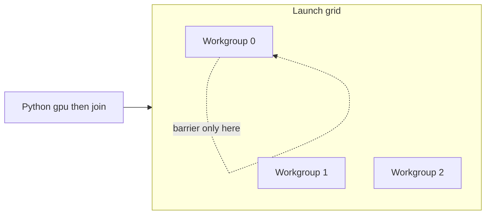

# GPU concepts

This page builds a mental model for `cthreads.gpu` without requiring prior GPU
experience. If you already know CUDA or Vulkan compute, skim for cthreads-specific
rules (writeback, lists-only, no mid-run Python sync).

# Contents

- [What a GPU kernel is](#what-a-gpu-kernel-is)
- [Host and device](#host-and-device)
- [Many workers, one program](#many-workers-one-program)
- [Workgroups and the grid](#workgroups-and-the-grid)
- [How data moves](#how-data-moves)
- [Writeback vs residency](#writeback-vs-residency)
- [CPU `@Thread` vs GPU `@Gpu`](#cpu-thread-vs-gpu-gpu)
- [What 0.2.0 does not include](#what-020-does-not-include)
- [Glossary](#glossary)

# What a GPU kernel is

A **GPU kernel** is a short function that the GPU runs many times in parallel.
You write it once in Python with `@Gpu`. cthreads compiles it to a compute shader
(GLSL, then SPIR-V) and dispatches it on the Vulkan device.

The usual pattern is **one invocation per array element** (or per particle, pixel,
and so on):

```python
from cthreads.gpu import Gpu, GlobalIdx

@Gpu
def scale(n: int, factor: float, data: list[float]) -> None:
    i: int = GlobalIdx.x
    if i >= n:
        return
    data[i] = data[i] * factor
```

Invocation `i` only touches `data[i]`. Thousands of invocations can run at once.
That is the main reason GPUs help on large, regular loops.

# Host and device

| Role | Where | In cthreads |
|------|-------|-------------|
| **Host** | CPU + Python | Build lists, call `gpu(...)`, call `join()` |
| **Device** | GPU | Run the compiled `@Gpu` body |

The host does **not** see intermediate GPU memory while the kernel runs. After
`join()` (by default), list arguments that the kernel mutated are copied back into
the same Python list objects you passed in.

```text
Python lists  --upload-->  GPU buffers  --kernel-->  GPU buffers  --download-->  Python lists
                 (launch)                              (join, default)
```

This is close to the CPU pack / writeback model in [concepts.md](../../concepts.md),
with one important difference: on GPU there is **no** mid-run `sync_state` into
Python. Observation happens on join (or via `GpuArena.sync` for resident buffers).

# Many workers, one program

Think of each parallel copy of the kernel as an **invocation** (CUDA often says
"thread"; GLSL says "invocation"). Every invocation runs the **same** function body.
They differ only by their index builtins (`GlobalIdx.x`, and so on).

Implications:

1. **Branch divergence.** If half the invocations take an `if` branch and half do
   not, hardware still has to schedule both paths. Prefer uniform control flow when
   you can.
2. **Bounds checks.** Dispatch size is often rounded up to a multiple of the
   workgroup size. Extra invocations must early-return: `if i >= n: return`.
3. **No shared Python state.** Invocations do not share Python objects. They share
   GPU buffers (your lists) according to the memory model of the shader.

# Workgroups and the grid

Invocations are grouped into **workgroups** (CUDA: blocks). A launch is a **grid**
of workgroups.

```text
grid (all workgroups)
  workgroup 0: invocations 0 .. local_size-1
  workgroup 1: invocations local_size .. 2*local_size-1
  ...
```

Default `local_size_x` in cthreads is **64**. Launch chooses how many workgroups to
run so that `group_count_x * 64` covers your problem size (see [indexes.md](./indexes.md)).

Why this matters:

- **`__sync_threads()` / `Barrier.arrive_and_wait()`** wait only for invocations
  **inside one workgroup**. They do not wait for the whole grid.
- Algorithms that need every element of a large array to "meet" after a step need
  either another `gpu()` launch (host-side phase) or future shared-memory tile
  patterns inside a workgroup.



# How data moves

### Scalars

Parameters typed as `int`, `float`, or `bool` are packed into a small storage
buffer and read by the shader. They are **not** written back to Python on join.
Treat them as inputs (counts, coefficients, flags).

### Lists

Parameters typed as `list[int]`, `list[float]`, or `list[bool]` become storage
buffers. On a default launch:

1. Host bytes are uploaded.
2. The kernel reads and/or writes elements.
3. On `join()`, mutated lists are downloaded into the **same** Python list objects
   (`pass_as="ref"`).

Empty lists are not useful for binding: arena bind requires a non-empty list to
infer element type, and a zero-length problem usually means "do not launch."

### Binding layout (intuition)

Scalars share one buffer; each list gets its own. You do not manage bindings by
hand. The rule of thumb: **pass everything the kernel needs as annotated
parameters**.

# Writeback vs residency

| Mode | When to use | Host traffic |
|------|-------------|--------------|
| Default `gpu(...).join()` | One-shot or infrequent launches | Upload + download each launch |
| `GpuArena` + `join(download=False)` | Many launches over the same lists | Upload on `bind` / re-upload when you change host data; download on `arena.sync()` |

Residency does not change kernel code. You still pass the **same list objects** to
`gpu()`. See [arena.md](./arena.md).

# CPU `@Thread` vs GPU `@Gpu`

| | `@Thread` (CPU) | `@Gpu` (GPU) |
|--|-----------------|--------------|
| Backend | Native C++ workers | Vulkan compute |
| Return values | Yes | Always `-> None` |
| Mid-run Python sync | `sync_state` / `__sync_state` | Not available |
| Rich types | `dict`, `str`, `@Threadable`, sync types | Scalars + `list` of scalars |
| Parallelism model | One job ~ one OS thread (or pool) | Many invocations per launch |
| Barrier | Host `Barrier(parties)` | Workgroup `__sync_threads` / `Barrier.arrive_and_wait()` |

Use **CPU** when the work is irregular, needs Python-visible mid-run state, or
needs richer types. Use **GPU** when you have large, regular element-wise or
stencil-like passes over arrays.

# What 0.2.0 does not include

Documented so expectations stay accurate:

- Workgroup **shared memory** arrays (planned for 0.2.1)
- Device **atomics** in the dialect
- Grid-wide barriers inside one kernel
- Public buffer objects / explicit Vulkan handles on the default path
- Launching `@Gpu` from inside `@Thread` (future design note:
  [gpu_future_cpu_to_gpu.md](../../gpu_future_cpu_to_gpu.md))
- macOS / MoltenVK as a first-class target in this release line

# Glossary

| Term | Meaning in cthreads |
|------|---------------------|
| **Invocation** | One parallel run of the `@Gpu` body (one index) |
| **Workgroup** | Group of invocations that can use a workgroup barrier together |
| **Grid** | All workgroups in one `gpu()` launch |
| **Host** | Python / CPU side |
| **Device** | GPU side |
| **Writeback** | Copy list buffers into Python lists on join |
| **Residency** | Keep buffers on device across launches (`GpuArena`) |
| **SPIR-V** | Binary shader format Vulkan consumes |
| **SSBO** | Storage buffer for kernel parameters / lists |

## See also

- [quickstart.md](./quickstart.md)
- [best_practices.md](./best_practices.md)
- [CPU concepts](../../concepts.md)
