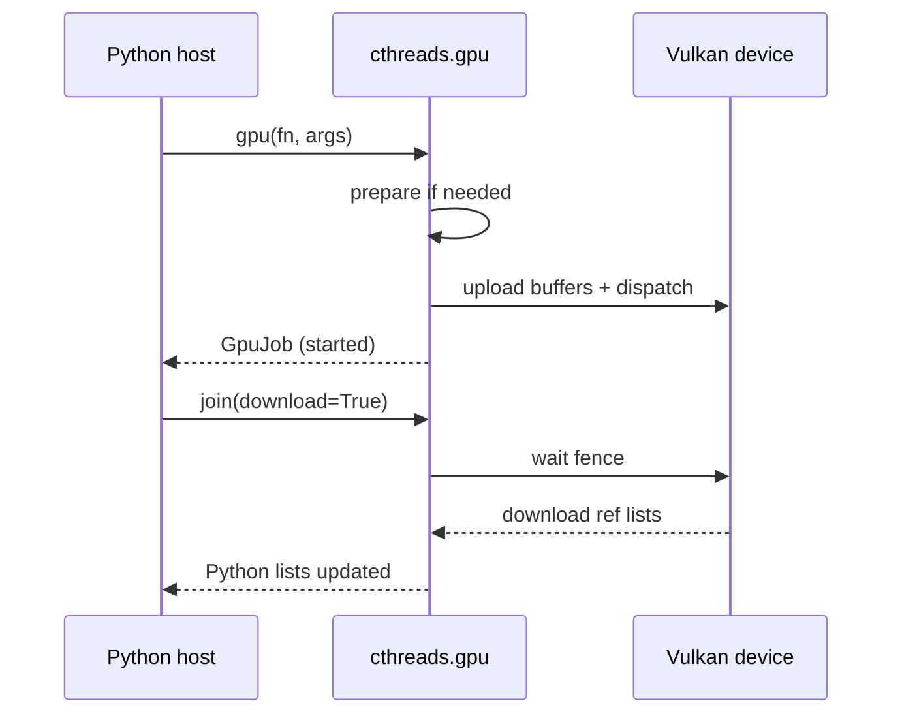

# Launch and jobs

Public entry points: `prepare`, `compile`, `gpu`, and `GpuJob`.

# Contents

- [Imports](#imports)
- [`prepare` and `compile`](#prepare-and-compile)
- [`gpu(fn, *args)`](#gpufn-args)
- [`GpuJob`](#gpujob)
- [Join and download](#join-and-download)
- [Force rebuild](#force-rebuild)
- [Await](#await)
- [Lifecycle diagram](#lifecycle-diagram)

# Imports

```python
from cthreads.gpu import Gpu, gpu, prepare, compile, GpuJob
# or:
from cthreads import gpu as gpu_mod
gpu_mod.prepare()
```

The package `cthreads.gpu` re-exports the launch helpers. The probe helpers
`available`, `device_name`, `init`, and `shutdown` live there as well
([errors.md](./errors.md)).

# `prepare` and `compile`

| Call | Role |
|------|------|
| `compile(force=False)` | Walk registered `@Gpu` functions and emit SPIR-V / cache artifacts |
| `prepare(force=False)` | Ensure Vulkan is available, then `compile` |

`gpu()` calls `prepare` automatically on first launch in the process (or when
`force=True`). Explicit `prepare()` is useful to fail fast at startup:

```python
from cthreads.gpu import prepare

prepare()  # raises GPUNotAvailable if the device path is unusable
```

`prepare(force=True)` shuts down and re-inits Vulkan, then force-rebuilds GPU
units. Use after intentional device reset scenarios, not on every frame.

# `gpu(fn, *args)`

```python
job = gpu(saxpy, n, a, x, y)
```

Requirements:

- `fn` must be decorated with `@Gpu`.
- Arguments are **positional only** (no keyword args yet).
- Arity must match the kernel signature.
- GPU must be available.

Behavior:

1. Prepare/compile if this process has not prepared yet.
2. Build ordered values from metadata.
3. Infer `group_count_x` when needed ([indexes.md](./indexes.md)).
4. Attach residency metadata for arena-bound lists ([arena.md](./arena.md)).
5. Launch via the native path and return a started `GpuJob`.

# `GpuJob`

`GpuJob` subclasses the CPU `Job` handle with GPU-specific join behavior.

| Method | Behavior |
|--------|----------|
| `start()` | Already called by `gpu()`; safe to think of the job as running |
| `join(download=True)` | Wait for the GPU fence; optionally download ref lists |
| `result()` | Always `None` (void kernels) |
| `await job` | Async wait (same idea as CPU jobs) |

There is no GPU equivalent of CPU `job.sync_state()` for mid-run Python observe.

# Join and download

```python
job.join()                  # wait + download list args (default)
job.join(download=False)    # wait only; lists stay on device / unsynced to Python
```

Use `download=False` together with `GpuArena`:

- Avoids host round-trips on every iteration of a multi-launch loop.
- Python list contents are **stale** until `arena.sync()` (or a later join with
  download enabled on a non-resident path).

If you pass `download=False` on a build without residency support, cthreads
raises `GpuInvalidArgument` with a rebuild hint.

# Force rebuild

```python
gpu(saxpy, n, a, x, y, force=True)
```

Forces re-prepare (Vulkan re-init + recompile). Useful while iterating on kernel
source during development. Avoid in tight production loops.

# Await

```python
import asyncio
from cthreads.gpu import gpu

async def run():
    job = gpu(saxpy, n, a, x, y)
    await job
    # y updated after await completes (default download)

asyncio.run(run())
```

# Lifecycle diagram



## See also

- [arena.md](./arena.md)
- [quickstart.md](./quickstart.md)
- [CPU jobs](../jobs.md) - shared job vocabulary where it applies
