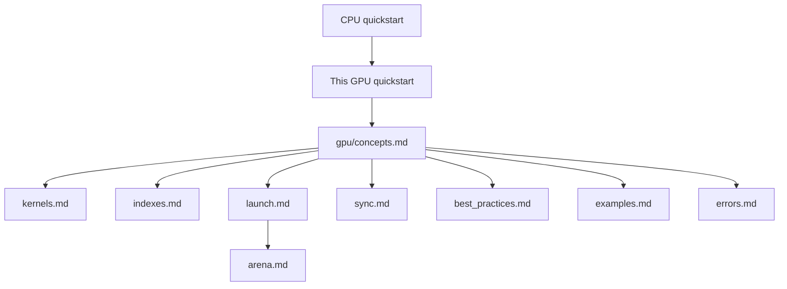

# GPU quickstart

This page is the linear start for the public **Vulkan** GPU path in cthreads. Vulkan is a cross-vendor GPU API. cthreads lowers `@Gpu` kernels to **SPIR-V** (an intermediate shader form Vulkan compute pipelines consume).

You should already know the CPU basics (types, `@Thread`, pack / writeback). If not, read the [CPU quickstart](../../quickstart.md) first.

Install the GPU package (do not also install plain `cthreads`):

```bash
pip install cthreads-gpu
```

More install detail: [install.md](../../install.md).

---

## Reading map

GitHub renders Mermaid diagrams. Clickable links inside Mermaid are unreliable on GitHub. Use the diagram for shape. Use the numbered list under it for real links.



1. [CPU quickstart](../../quickstart.md) - types, compile, launch on CPU
2. **This page** - probe, first `@Gpu` kernel, join, arena sketch
3. [concepts.md](./concepts.md) - host vs device, workgroups, writeback
4. Then deepen as needed:
   - [kernels.md](./kernels.md)
   - [indexes.md](./indexes.md)
   - [launch.md](./launch.md)
   - [arena.md](./arena.md)
   - [sync.md](./sync.md)
   - [best_practices.md](./best_practices.md)
   - [examples.md](./examples.md)
   - [errors.md](./errors.md)
5. Hub overview: [README.md](./README.md)

---

## Confirm the GPU path

```python
from cthreads import gpu

# Soft probe. False means this install or machine cannot run @Gpu.
print(gpu.available())
if gpu.available():
    print(gpu.device_name())
```

If `available()` is `False`, stop and read [errors.md](./errors.md). Decorating `@Gpu` or calling `gpu()` raises when the path is not usable.

---

## Types on GPU

GPU kernels are narrower than CPU kernels today.

Allowed arguments:

- `int`, `float`, `bool`
- `list` of those scalars

Returns must be `-> None`. Results come back by writing into list arguments (writeback on `join`). Locals still need annotated assignment (`i: int = ...`).

There is no `@Threadable`, `str`, or `dict` on the public GPU path yet.

---

## Decorator: `@Gpu`

`@Gpu` marks a function for compilation to a compute shader. Calling the function as ordinary Python still runs the Python body. Device execution happens only through `gpu(fn, ...)`.

```python
from cthreads.gpu import Gpu, GlobalIdx, gpu

@Gpu
def saxpy(n: int, a: float, x: list[float], y: list[float]) -> None:
    # GlobalIdx.x is this invocation's 1D index in the launch grid.
    i: int = GlobalIdx.x
    # Dispatch may pad past n. Always guard.
    if i >= n:
        return
    y[i] = a * x[i] + y[i]
```

**GlobalIdx** is an index builtin. For 1D element-wise work, `.x` is the flat index you usually want. More index forms: [indexes.md](./indexes.md).

---

## Launch and join

```python
from cthreads.gpu import Gpu, GlobalIdx, gpu

@Gpu
def saxpy(n: int, a: float, x: list[float], y: list[float]) -> None:
    i: int = GlobalIdx.x
    if i >= n:
        return
    y[i] = a * x[i] + y[i]

x: list[float] = [1.0, 2.0, 3.0, 4.0]
y: list[float] = [10.0, 20.0, 30.0, 40.0]
n: int = len(x)
a: float = 2.0

# First gpu() in a process may compile SPIR-V (cached afterward).
job = gpu(saxpy, n, a, x, y)
job.join()
print(y)  # [12.0, 24.0, 36.0, 48.0]
```

What `gpu()` does on first use:

1. Checks that Vulkan is usable.
2. Compiles registered `@Gpu` functions to SPIR-V (then caches them).
3. Uploads arguments and records a compute dispatch.
4. Returns a **GpuJob** that is already started.

`join()` waits for the GPU fence. By default it downloads list arguments into the same Python list objects you passed. `job.result()` is always `None` on this path.

---

## Optional: keep lists on device

When you launch many kernels over the same lists, bind them once with **GpuArena**. That reduces host traffic between passes.

```python
from cthreads.gpu import GpuArena, gpu

with GpuArena() as arena:
    arena.bind(x=x, y=y)
    for _ in range(100):
        # download=False skips writeback until you ask for it.
        gpu(saxpy, n, a, x, y).join(download=False)
    arena.sync()  # copy device lists back into x and y for Python
```

Full guide: [arena.md](./arena.md).

---

## Specialized tools (short map)

### Indexes and dispatch

`GlobalIdx`, `ThreadIdx`, `BlockIdx`, and related builtins describe where an invocation sits in the grid. Dispatch rounds up to a workgroup size. Always bounds-check with `n`.

Guide: [indexes.md](./indexes.md).

### Launch details

`prepare`, compile caching, `GpuJob.join(download=...)`, and error cases.

Guide: [launch.md](./launch.md).

### Workgroup barriers

`__sync_threads()` and `Barrier.arrive_and_wait()` meet inside **one workgroup**. They are not a whole-grid barrier. Workgroup **shared memory** arrays are not in the public dialect yet. Prefer multiple `gpu()` launches for global phases.

Guide: [sync.md](./sync.md).

### Practices and examples

Patterns that stay correct: [best_practices.md](./best_practices.md). More samples: [examples.md](./examples.md). Troubleshooting: [errors.md](./errors.md).

---

## Common first mistakes

| Mistake | What happens | Fix |
|---------|--------------|-----|
| Missing `if i >= n: return` | Out-of-range writes on padded invocations | Always bounds-check |
| Expecting `job.result()` to hold an array | Always `None` | Read list args after join |
| Using `dict` / `@Threadable` / `str` args | Type error at decorate or compile | Scalars and scalar lists only |
| Calling `__sync_threads()` from plain Python | Runtime error | Only inside `@Gpu` bodies |
| Assuming a barrier syncs the whole array | Only one workgroup waits | Use multiple host launches for global phases |
| `pip install cthreads` then expecting `@Gpu` | GPU not built into that wheel | Install `cthreads-gpu` alone |

---

## Next step

Read [concepts.md](./concepts.md) for host vs device vocabulary. Then skim [kernels.md](./kernels.md) before you write larger kernels.
