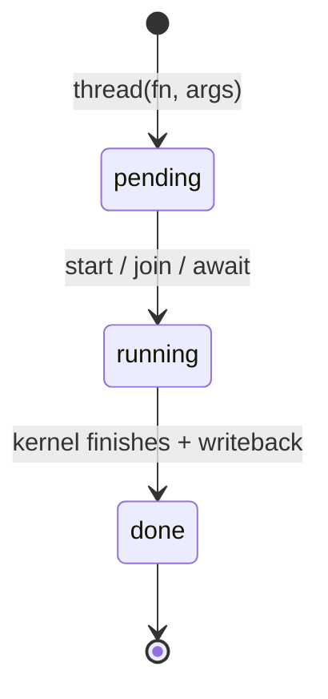

# Jobs

`cthreads.thread(fn, *args)` returns a **`Job`**. That object is the handle for one kernel run: start it, wait for it, read the return value, and (optionally) pull pack state into Python while it is still running.

`thread(...)` does **not** start the OS thread by itself. It packs arguments and returns a pending job. The worker starts on `job.start()`, `job.join()`, or `await job`. The first `thread(...)` in a process also runs cache-checked `prepare` + `load_kernels` if nothing is loaded yet.

```python
import cthreads
from cthreads import Thread

@Thread
def count(start: int, n_steps: int) -> int:
    for i in range(n_steps):
        start += 1
    return start

job = cthreads.thread(count, 1, 100_000)
job.join()                 # starts if needed; blocks this OS thread (GIL released in C++)
print(job.result())        # 100001
```

# Contents

<!-- @import "[TOC]" {cmd="toc" depthFrom=1 depthTo=6 orderedList=false} -->

<!-- code_chunk_output -->

- [Jobs](#jobs)
- [Contents](#contents)
- [Lifecycle](#lifecycle)
- [Waiting (`join` / `await` / `wait`)](#waiting-join--await--wait)
- [Results and writeback](#results-and-writeback)
- [Mid-run state (`sync_state`)](#mid-run-state-sync_state)
- [`thread` vs `spawn`](#thread-vs-spawn)
- [See also](#see-also)

<!-- /code_chunk_output -->

# Lifecycle



| Method | Role |
|---|---|
| `job.start()` | Start the worker. Idempotent (a second call is a no-op). Returns `self` so you can chain. |
| `job.done()` | True after the kernel has finished (and final writeback has run). |
| `job.join()` | Auto-start if needed. Block this OS thread until done. Releases the GIL while waiting. |
| `await job` | Auto-start if needed. Wait **without** blocking the asyncio event loop. Returns `job.result()`. |
| `job.wait()` | Block until done (condition wait). Prefer `join()` so the thread is reaped. |
| `job.result()` | Return value of the `@Thread` function (`None` if `-> None`). Call after `join`, or use `await job`. |
| `job.sync_state()` | Mid-run pack → Python writeback. Job must already be **started**. No-op once finished. |

`print(job)` shows `pending`, `running`, or `done`.

# Waiting (`join` / `await` / `wait`)

**Sync code** (scripts, notebooks): `join()`, then `result()`.

**Async code** (FastAPI, asyncio): `await job`. That starts the job, waits on a worker thread so the event loop stays free, and returns the result directly:

```python
job = cthreads.thread(count, 1, 100_000)
value = await job          # no separate .result() needed
```

`join` does **not** freeze the whole process: the waiting Python thread drops the GIL, so other Python threads and already-running kernels can proceed.

Call `start()` yourself when you want the worker running **before** you set up the wait (poll loop, UI tick, then `join` at the end).

# Results and writeback

The kernel mutates a **C++ pack**, not live Python objects. On `join` / `await`, cthreads writes mutable job args (`list`, `dict`, `@Threadable`) back into the Python objects you passed in, and stores the return value for `result()`.

Until that writeback (or an explicit mid-run sync), Python still holds the **launch snapshot**.

Scalars such as `int` / `float` are not updated in-place on the host; return them if you need the new value (`count` above).

# Mid-run state (`sync_state`)

For a long job (simulation, render loop) the host can copy pack → Python **before** `join`:

| API | Who calls it | When to use |
|---|---|---|
| `job.sync_state()` / `cthreads.sync_state(job)` | Host | UI / logs decide the poll rate |
| `__sync_state()` | Inside `@Thread` | Kernel decides safe points (end of frame, every N steps) |

Same copy direction. `sync_state` takes the job mutex and the GIL, so it is the wrong tool for hundreds of full snapshots per second. For high-rate frames use [`TBuffer`](./sync.md#the-high-performance-non-blocking-alternative-tbuffer). Locks (`Lock` / `RWLock`) are separate: they serialize shared access; they do not replace writeback.

The job must already be **started**. `sync_state` after the kernel has finished is a no-op (final writeback already ran).

```python
from cthreads import math as cm
from cthreads import Thread, Threadable, __sync_state


@Threadable
class State:
    counter: int
    x: float
    y: float

    @Thread
    def move(self, noise: float) -> None:
        self.counter += 1
        self.x += cm.uniform(-noise, noise)
        self.y += cm.uniform(-noise, noise)


@Thread
def sim(states: list[State], n: int, steps: int, noise: float) -> None:
    for i in range(steps):
        for j in range(n):
            states[j].move(noise)


if __name__ == "__main__":
    import cthreads

    n = 5
    states: list[State] = [State() for _ in range(n)]

    job = cthreads.thread(sim, states, n, 1_000_000, 0.1)
    job.start()
    while not job.done():
        job.sync_state()
        print(f"counts: {[state.counter for state in states]}")
    job.join()
```

Example output (exact numbers vary):

```text
counts: [0, 0, 0, 0, 0]
counts: [1159, 2072, 2696, 3223, 3744]
counts: [9965, 10577, 10934, 11264, 11601]
```

Counters on one snapshot are often **uneven**. One job walks `states[0]`, then `[1]`, …; a host poll can land in the middle of that inner loop. The kernel also keeps running **between** polls, so values jump. That is expected, not a broken counter.

Without `job.sync_state()` (and without `__sync_state()` in the kernel), those prints stay at `[0, 0, 0, 0, 0]` until `join`.

Kernel-driven alternative: call `__sync_state()` inside `move` / `sim` at a safe point, then read `states` on the host. Import `from cthreads import __sync_state` so the name exists at compile time; it is only valid inside `@Thread` bodies.

**Practices:**

- `sync_state` updates the Python objects that were **job args**, not random aliases or parent containers.
- If two jobs share one Python list / Threadable, last writeback wins. Use a `Lock` if they must not overlap.
- Prefer `__sync_state()` when the worker knows the barrier; prefer `job.sync_state()` when the UI owns the frame rate.

# `thread` vs `spawn`

| | `cthreads.thread` | `cthreads.spawn` |
|---|---|---|
| Kernels not loaded | `prepare` + `load_kernels`, then spawn | Requires kernels already loaded |
| Typical use | Default | Servers that `prepare` / `load_kernels` in startup |

Signature: `thread(fn, *args, force=False, **kwargs) -> Job`. Keyword args bind by parameter name.

`force=True` rebuilds kernels. If a library is already loaded, that raises — call `unload_kernels()` first (required on Windows before relinking the DLL).

Many jobs at once: see [pools](./pools.md).

# See also

- [concepts.md](../concepts.md) - pack / writeback, `@Thread` rules
- [sync.md](./sync.md) - locks, `__sync_state`, `TBuffer`
- [install.md](../install.md) - first `thread(...)` compile, `unload_kernels`
