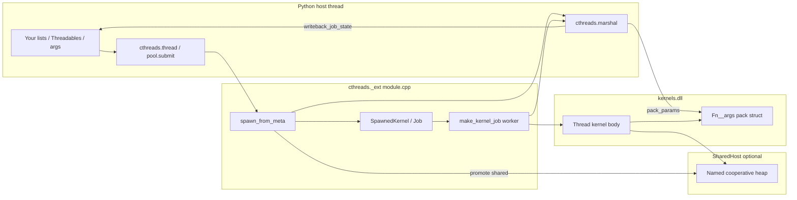

# Marshal and module.cpp — how Python args reach native kernels

This guide explains the two halves of cthreads job launch:

1. **`cthreads.marshal`** (Python) — walks compile-time schemas and reads/writes C++ data through the kernel DLL’s trampoline accessors.
2. **`src/cthreads/cpp/bindings/module.cpp`** (native `_ext`) — owns `Job` objects, allocates the per-job **pack**, calls marshal, runs the kernel off the GIL, and mirrors results back to Python.

Together they implement the **pack model**: each `@Thread` job gets a private C++ args struct (the pack). Python passes **values** at spawn; workers mutate **native** memory; sync copies native state back into the **same Python objects** you passed in.

---

## The big picture (one sentence)

**Python values → pack (spawn) → kernel runs on pack (+ SharedHost for cooperative `Shared[T]`) → writeback/sync copies pack (and shared host) → Python again.**



---

## Part 1 — What is a “pack”?

When you compile `@Thread def step(p: Particle, xs: list[float])`, codegen emits:

| Artifact | Example name | Role |
|----------|--------------|------|
| Args struct | `step__args` | Holds one copy of each parameter (+ optional `ret`) |
| Alloc | `step__args_new()` | `new step__args` |
| Free | `step__args_free(p)` | `delete` the pack |
| Call trampoline | `step__call(p)` | Reads pack fields, calls your compiled `step(...)` |
| Field accessors | `step__set_a0_x`, `step__get_a0_x`, … | Marshaling API used by Python |

**Important:** the pack is **per job**. Two concurrent `thread()` calls → two packs → no cross-job clobber (marshal never uses a global pack slot).

The pack also carries a **`SharedHost* __shared_host`** pointer (always present in current trampolines). Cooperative **`Shared[T]`** params are read from the host at call time; staging fields `a{i}` still exist for marshal promote/demote.

---

## Part 2 — `marshal.py` in depth

File: `src/cthreads/python/cthreads/marshal.py`

### 2.1 Design constraints (read the module docstring)

- **Explicit pack pointer** on every entry point — thread-safe across concurrent jobs.
- **Cached `CDLL`** — one load per kernel path; avoids Windows loader deadlocks.
- **`_call` uses `CFUNCTYPE` per call** — never mutates `fn.argtypes` on shared CDLL symbols (that used to race and hang).

### 2.2 `_Path` — addressing nested data

Lists and dicts in the pack are not flat. A list element `xs[3]` or dict key `"foo"` needs extra index/key arguments on accessor functions.

```python
@dataclass
class _Path:
    indices: list[int] = field(default_factory=list)
    keys: list[tuple[str, Any]] = field(default_factory=list)
```

- **`indices`** — appended for each list level (`size_t` extras in C++).
- **`keys`** — `("str", "foo")` or `("int", 42)` for dict keys.

`_extra(path)` turns a path into ctypes arguments; `_ctype_extras(path)` builds the matching argtypes list.

### 2.3 Primitives — `_set_prim` / `_get_prim`

For parameter prefix `a0` and float field, marshal calls:

```text
step__set_a0(pack, ..., double value)
step__get_a0(pack, ..., double* out)
```

Strings use a length helper + buffer copy on read. This is the simplest round-trip.

### 2.4 `pack_value` — recursive pack (Python → C++)

Called for each parameter slot `a{i}` with that param’s **TypeSchema** (from `__kernel_meta__`).

| `schema.kind` | Behaviour |
|---------------|-----------|
| `int/float/bool/str` | `_set_prim` |
| `threadable` | For each field `f`, recurse with prefix `a0_f` |
| `list` | `resize` then pack each element via `a0_elem` + child path |
| `dict` | `clear`, then insert/ensure keys |
| `tbuffer` | Store **native pointer** via `__set_a{i}_ptr` (no copy) |
| `sync` | Store Lock/Event/RWLock pointer (no copy) |

**TBuffer / sync are not copied** — only the address of an existing host/native object is stored. That is how multiple jobs share one triple buffer when you pass the same handle.

### 2.5 `unpack_value` — recursive unpack (C++ → Python)

Mirror of `pack_value`. Used for:

- Return values (`prefix="ret"`)
- Writeback into existing Python objects (`into=val`)

For threadables, **`into`** is updated in place (same object you passed to `thread()`).

### 2.6 Top-level entry points

#### `pack_params(symbol, params, values, pack_ptr, ...)`

```python
for i, (p, val) in enumerate(zip(params, values)):
    pack_value(lib, symbol, f"a{i}", schema, val, _Path(), pack, ...)
```

Called from C++ `fill_pack_from_values` during **`spawn_from_meta`**. This includes **`Shared[T]`** params: they are staged into `a{i}` first (same as `ref`), then promoted to the `SharedHost` (see below).

#### `writeback_params`

Only writes back **mutable mirror types**:

- `threadable`, `list`, `dict`

Skips primitives (by-value), `tbuffer`, `sync`.

#### `promote_shared_to_host` / `demote_shared_from_host`

These call **kernel-emitted** symbols (typed, schema-aware in C++):

```text
worker__promote_a0_shared(pack, SharedHost*)
worker__demote_a0_shared(pack, SharedHost*)
worker__demote_return_shared(pack, SharedHost*)   # if return is Shared[T]
```

- **Promote (spawn):** move staged `a{i}` → `host->set(name, …)` (first job seeds; later jobs no-op on `set` but still register).
- **Demote (sync/return):** copy `host->get<T>(name)` → staged `a{i}` so existing pack accessors + `writeback_params` / `unpack_return` work unchanged.

#### `writeback_job_state`

```python
demote_shared_from_host(...)
writeback_params(...)
```

Used for **`__sync_state()`**, **`job.sync_state()`**, and final job completion — one unified path.

#### `unpack_return(meta, pack_ptr, host_ptr=0)`

If `meta["return_pass_as"] == "shared"`, demotes `__return__` from the host into `pack.ret`, then uses normal `unpack_value` on `ret`.

---

## Part 3 — `module.cpp` in depth

File: `src/cthreads/cpp/bindings/module.cpp`  
Python module: **`cthreads._ext`**

### 3.1 Global state (anonymous namespace)

```cpp
static std::shared_ptr<cthreads::SharedHost> default_shared_host = ...;
thread_local JobContext* g_job = nullptr;
```

| Symbol | Purpose |
|--------|---------|
| `default_shared_host` | Cooperative heap for bare `cthreads.thread()` jobs |
| `g_job` | Per-worker TLS notebook for mid-run `__sync_state()` |
| `g_ext_sync_invocations` | Test counter |

Pool jobs use **`pool->shared_host`** instead (see `basePool.hpp`).

### 3.2 `SpawnedKernel` — the C++ side of `Job`

Key fields:

| Field | Purpose |
|-------|---------|
| `pack` / `free_fn` | Own the args struct until writeback finishes |
| `values_keep` | Python arg objects writeback targets |
| `meta_keep` / `types_keep` / `schemas_keep` | Marshal metadata |
| `shared_host` | `shared_ptr` keeping the host alive |
| `shared_param_symbols` / `shared_cleanup_symbols` / `shared_lifecycle_active` | Register param slots on spawn; unregister params + `__return__` after final copy |
| `state_mu` | Serializes kernel sync vs host `sync_state` vs final writeback |
| `thr` or `done_*` | Dedicated OS thread vs pool completion |

**Lock order everywhere:** `state_mu` first, then GIL. Never reverse (deadlock with host sync).

### 3.3 `spawn_from_meta` — the launch pipeline

This is the **main entry point** for both `cthreads.thread()` and `pool.submit()`.

Rough order:

1. **Validate** meta, arg count, kernel symbols loaded.
2. **`pack = Fn__args_new()`** — allocate empty pack in the kernel DLL heap.
3. **`fill_pack_from_values`** → Python `marshal.pack_params` — fill staging fields (including shared).
4. **Resolve SharedHost** — pool’s host or `default_shared_host`.
5. **`promote_shared_to_host`** — move shared params into named host slots.
6. **`register_job(shared_symbols)`** — bump per-symbol refcounts (queued jobs count too).
7. **`attach_shared_host_to_pack`** — `Fn__set_shared_host(pack, host)`.
8. Build **`make_kernel_job`** closure; queue on pool or wrap in `CThread`.
9. Return **`shared_ptr<SpawnedKernel>`** to Python as `Job`.

On spawn failure after `pack` alloc, **`args_free`** runs in the catch block.

### 3.4 `make_kernel_job` — what actually runs on the worker

```cpp
// 1) Install JobContext for __sync_state
ctx.pack = self->pack;
ctx.shared_host = self->shared_host.get();
ctx.meta = self->meta_keep.get();
set_job_context(&ctx);

// 2) Run kernel (GIL released)
call_fn(self->pack);

// 3) Final writeback under state_mu + GIL
writeback_job_state(...);   // demote shared + writeback ref args
read_return(...);           // demote shared return - Python copy (pack.ret)
unregister_shared_if_needed();  // drops param slots + __return__ on host (ref->0)
free pack;
```

`unregister_shared_if_needed()` uses **`shared_cleanup_symbols`**: shared param names plus `__return__` when `return_pass_as == "shared"`. Slots that exist on the host are destroyed after `read_return` has copied the return into the cached `job.result()` object.

If the kernel throws, TLS is cleared and shared registration is undone without final writeback.

### 3.5 Mid-run sync — `__sync_state()` path

Generated kernels call `cthreads::detail::__sync_state()` -> bridge -> **`cthreads_ext_sync_state`**:

```cpp
void job_do_writeback(JobContext* ctx) {
    lock(state_mu);
    acquire GIL;
    writeback_job_state(..., ctx->shared_host, *meta);
}
```

Host Python can also call **`job.sync_state()`** — same effect via `SpawnedKernel::sync_state()` (uses stored pack/meta, not TLS).

**Shared[T] is not live-synced like TBuffer.** Python updates only when sync runs (or on `join()` / `result()` at the end).

### 3.6 `SharedHost` refcount model

`SharedHost` (`shared_host.hpp`):

- **`set(name, T)`** — first writer allocates; later `set` for same name is a no-op (cooperative seed once).
- **`register_job(names)`** — each participating job increments symbol refs at spawn.
- **`unregister_job(names)`** — on job end; destroys symbol when last ref hits zero.
- **`replace(name, T)`** — used for **`Shared` return** snapshot into `__return__`.

Bare threads and pools share the same mechanism; only the **`shared_ptr` owner** differs.

---

## Part 4 — Pass modes compared

| Annotation | Native storage during run | Pack staging | Python sync |
|------------|---------------------------|--------------|-------------|
| `int`, `float`, … | Pack copy (by value) | Same | N/A (immutable snapshot) |
| `list`, `dict`, `@Threadable` | Pack copy | Same | `writeback_params` from pack |
| `Shared[T]` | **SharedHost** named slot | Promote/demote bridge | `writeback_job_state` |
| `TBuffer[...]` | Existing triple buffer | Pointer in pack | **No writeback** — host polls generation |
| `Lock`, `Event`, … | Existing sync object | Pointer in pack | No writeback |

---

## Part 5 — Worked example (shared list)

### Python

```python
from cthreads import Thread, Shared, compile, thread, load_kernels, build

@Thread
def worker(head: Shared[list[int]], i: int) -> None:
    head[i] = head[i] + 1
    __sync_state()  # optional mid-run mirror to Python

head = [0, 0, 0, 0]
compile(...)
load_kernels(build(...))
jobs = [thread(worker, head, i) for i in range(4)]
for j in jobs:
    j.start()
for j in jobs:
    j.join()
# head may still be stale until you sync one job or rely on final writeback per job
```

### Spawn (host thread, with GIL)

1. `bind_args` orders kwargs/positionals.
2. `pack_params` copies `head` → `worker__args.a0` (staging vector).
3. `worker__promote_a0_shared(pack, host)` → `host["head"]` owns the vector all workers share.
4. `host.register_job(["head"])` × 4 jobs → refcount 4.
5. Pack gets `__shared_host = host`.

### Worker (no GIL during kernel)

Trampoline effectively calls:

```cpp
worker(host->get<std::vector<int>>("head"), a->a1);
```

Each worker mutates the **same** native vector.

### Sync / join

`writeback_job_state` → demote host → staging `a0` → `writeback_params` → your Python **`head`** list updates.

When the last job unregisters, host destroys `"head"` if nothing else holds it.

---

## Part 6 — Worked example (classic ref list)

```python
@Thread
def bump(xs: list[int]) -> None:
    xs[0] += 1

xs = [1]
job = thread(bump, xs)
job.start()
job.join()
# xs[0] == 2 — writeback copied pack vector into Python list
```

Here every job would get its **own pack copy** unless you pass the same logical sharing via **`Shared[list[int]]`**.

---

## Part 7 — Function reference cheat sheet

### Python (`marshal.py`)

| Function | When |
|----------|------|
| `pack_params` | Spawn: Python → pack |
| `promote_shared_to_host` | Spawn: pack staging → SharedHost |
| `demote_shared_from_host` | Sync/return: SharedHost → pack staging |
| `writeback_params` | Sync: pack → Python (ref types) |
| `writeback_job_state` | demote + writeback_params |
| `unpack_return` | Join: pack.ret → Python value |

### C++ (`module.cpp`)

| Function | When |
|----------|------|
| `spawn_from_meta` | Create Job, pack, shared setup |
| `make_kernel_job` | Worker body |
| `job_do_writeback` | Kernel `__sync_state()` |
| `SpawnedKernel::sync_state` | Host-driven sync |
| `fill_pack_from_values` | Calls `pack_params` |
| `read_return` | Calls `unpack_return` |

---

## Part 8 — Mental model for debugging

1. **“Python doesn’t see my kernel writes”** — Did you call `sync_state` / `__sync_state`? Ref/shared mirror only on sync (except final join writeback). TBuffer uses generation, not writeback.
2. **“Workers don’t share state”** — Use **`Shared[T]`** or pass the same **TBuffer/sync** handle; plain `ref` lists are per-job pack copies.
3. **“Crash after pool stop”** — Abandoned queued jobs `unregister_shared` in `mark_done` if the worker never ran.
4. **“Missing symbol in marshal”** — Kernel DLL out of date; recompile so trampolines (`__promote_a0_shared`, etc.) exist.

---

## Part 9 — Related docs

- [sync_state_docs.md](../sync_state_docs.md) — TLS bridge and lock ordering
- [guide/jobs.md](./jobs.md) — Job lifecycle from Python
- [guide/sync.md](./sync.md) — TBuffer vs locks vs writeback

---

## Summary

- **`marshal.py`** speaks the kernel DLL’s accessor language: recursive schemas, explicit pack pointers, promote/demote for **`SharedHost`**.
- **`module.cpp`** owns job lifetime, runs kernels off the GIL, connects TLS sync to marshal, and keeps **`SharedHost`** alive per pool or process default.

The pack is the per-job mailbox; the SharedHost is the optional cooperative whiteboard across jobs; marshal is the translator between Python objects and both.
