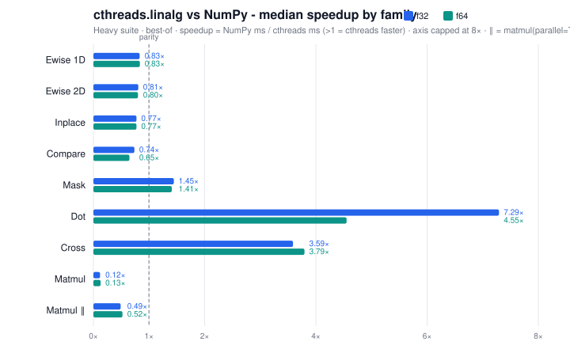

# Math and linalg

Three pieces, for different jobs:

| You want | Use |
|---|---|
| Scalar trig / logs / `pi` inside `@Thread` | Python `math` (`std::` in C++) |
| `abs` / `clamp` / RNG inside `@Thread` | `cthreads.math` |
| ND arrays, GEMM, masks (host, and as kernel locals) | `cthreads.linalg` |

`cthreads.linalg` is a native `_ext` type, not a `@Threadable`. On AVX2 CPUs, contiguous kernels use SIMD for ewise, compare, mask, dot, cross, and tiled GEMM. Numbers vs NumPy are at the bottom of this page.

# Contents

- [Two toolboxes](#two-toolboxes)
- [Python `math`](#python-math)
- [`cthreads.math`](#cthreadsmath)
- [`cthreads.linalg` arrays](#cthreadslinalg-arrays)
- [Views and layout](#views-and-layout)
- [Indexing](#indexing)
- [Elementwise, compare, mask](#elementwise-compare-mask)
- [Dot, cross, matmul](#dot-cross-matmul)
- [Inside `@Thread`](#inside-thread)
- [Common mistakes](#common-mistakes)
- [Performance vs NumPy](#performance-vs-numpy)

# Two toolboxes

**Scalars** belong in `@Thread` loops: `math.sin(x)`, `cm.clamp(v, 0.0, 1.0)`. That is the compiled path.

**Arrays** are the NumPy-shaped API on the host (`a + b`, `a.matmul(b)`). Call them from ordinary Python, or construct them as **locals** inside a kernel. They are not a drop-in for `numpy.ndarray` as a job argument (see [Inside `@Thread`](#inside-thread)).

```python
import math
from cthreads import Thread, math as cm, linalg, thread

ArrayF32 = linalg.ArrayF32

@Thread
def force(x: float, y: float) -> float:
    r: float = math.sqrt(x * x + y * y)
    return cm.clamp(r, 0.0, 10.0)

a = ArrayF32.from_list([[1.0, 2.0], [3.0, 4.0]])
b = ArrayF32.from_list([[5.0, 6.0], [7.0, 8.0]])
c = a.matmul(b)          # host, serial GEMM
c = a.matmul(b, parallel=True)  # host only; large M*N*K

job = thread(force, 3.0, 4.0)
job.join()
print(job.result(), c.to_list())
```

# Python `math`

Import the stdlib module (or `from math import sqrt`). The compiler resolves names through the function's globals and emits `<cmath>` / `<numbers>`.

```python
import math

@Thread
def wave(t: float) -> float:
    return math.sin(t * math.pi) + math.sqrt(2.0)
```

Supported calls are names that exist on your interpreter's `math` **and** are in the compiler table. Common ones:

| Group | Names | Arity |
|---|---|---|
| Roots / powers | `sqrt`, `cbrt`, `pow`, `hypot` | 1 / 1 / 2 / 2 |
| Rounding | `floor`, `ceil`, `trunc`, `fabs` | 1 |
| Exp / log | `exp`, `exp2`, `expm1`, `log`, `log2`, `log10`, `log1p` | 1 |
| Trig | `sin`, `cos`, `tan`, `asin`, `acos`, `atan`, `atan2` | 1 (atan2: 2) |
| Hyperbolic | `sinh`, `cosh`, `tanh`, `asinh`, `acosh`, `atanh` | 1 |
| Special | `erf`, `erfc`, `gamma` (`tgamma`), `lgamma`, `ldexp` | 1 (ldexp: 2) |
| Classify | `isfinite`, `isinf`, `isnan` | 1 |
| Extra | `fmod`, `remainder`, `copysign`, `fma` | 2 / 2 / 2 / 3 |

Constants: `math.pi`, `math.e`, `math.tau` (need `import math`, not `from math import pi` for the attribute form).

No keyword args (`math.pow(x, y=2)` is rejected). `**` on scalars is `std::pow`.

# `cthreads.math`

Helpers that are not (or not cleanly) stdlib `math`. Import as `from cthreads import math as cm` so you do not shadow the stdlib module.

```python
from cthreads import math as cm

@Thread
def sample(lo: float, hi: float) -> float:
    cm.seed(1)
    x: float = cm.uniform(lo, hi)
    return cm.clamp(cm.abs(x), lo, hi)
```

| Op | Args | Meaning |
|---|---|---|
| `abs` | 1 | Absolute value |
| `min`, `max` | 2 | Pairwise |
| `clamp` | 3 | `clamp(v, lo, hi)` |
| `random` | 0 | Float in `[0.0, 1.0)` |
| `uniform` | 2 | Float in `[lo, hi)` |
| `randint` | 2 | Int in `[lo, hi]` inclusive |
| `seed` | 1 | Seed the **current OS thread** engine |

RNG is `thread_local` (`std::mt19937`). Parallel jobs do not share state. `seed(n)` only affects the worker that runs it, not every job in the process. No keyword args.

# `cthreads.linalg` arrays

```python
from cthreads import linalg

a = linalg.ArrayF32([2, 3])          # zeros, C-contiguous, shape (2, 3)
b = linalg.ArrayF32.from_list([[1.0, 2.0], [3.0, 4.0]])
print(b.shape, b.ndim, b.numel, b.strides, b.offset)  # host: shape/strides are lists
nested = b.to_list()
```

| Python type | C++ | Element |
|---|---|---|
| `ArrayF32` | `Array<float>` | `float` |
| `ArrayF64` | `Array<double>` | `double` |
| `ArrayI32` | `Array<int>` | `int` |
| `ArrayBool` | `Array<uint8_t>` | bool (`True`/`False` in `from_list` / `to_list`) |

No mixing dtypes (`ArrayF32.matmul(ArrayF64)` raises). `len(a)` is the size of axis 0. `bool(a)` raises; use `.any()` / `.all()` / `.count()`.

On the **host**, `a.shape` / `a.strides` are Python lists. **Inside `@Thread`**, `a.shape` is a `Shape` (`(a).shape()` in C++). Use `a.numel` / `sh.numel()` rather than `len(a.shape)` in a kernel.

`Shape` and `Slice` are first-class:

```python
sh = linalg.Shape([2, 3])     # or Shape(5) for 1-D
sh.ndim()
sh.numel()
sh.strides()                  # row-major element strides, last axis = 1

s = linalg.Slice()            # full axis
s = linalg.Slice(4)           # stop
s = linalg.Slice(1, 5, 2)     # start, stop, step (>= 1)
```

Host constructors also take a Python list of dims: `ArrayF32([2, 3])`. Inside a kernel, `ArrayF32(sh)` or `ArrayF32([2, 3])` both lower.

# Views and layout

These return a new view on the **same storage** unless noted. Underscore names mutate `self`.

| Method | Args | Notes |
|---|---|---|
| `view` / `reshape` | shape | Same numel |
| `flatten` | | 1-D view when possible |
| `transpose` | | Reverse axes |
| `permute` | axis order | |
| `squeeze` / `unsqueeze` | axis | |
| `contiguous` | | Always a dense C-contiguous **copy** |
| `_view`, `_reshape`, ... | same | In-place on this object |
| `is_contiguous` | | AVX fast paths want this true |

Host `reshape` / `view` / `permute` take a list of ints: `a.reshape([6])`. SIMD kernels run on contiguous data; a transpose without `contiguous()` falls back to slower gathers.

# Indexing

**Host Python** matches a small NumPy subset:

```python
a = linalg.ArrayF32.from_list([[1.0, 2.0, 3.0], [4.0, 5.0, 6.0]])
a[0]            # row view, shape [3]
a[1, 2]         # scalar 6.0
a[0:1]          # slice on axis 0
a[-1, -1]       # negatives OK on the host
a[mask]         # boolean prefix mask -> gather (see below)
a[1, 2] = 9.0
```

Slice step must be `>= 1`. Item assignment is a full integer index (or a boolean mask), not a slice write.

**Inside `@Thread`:** Python slice syntax (`a[1:3]`) is rejected. Use an integer subscript or a `Slice` value: `row = a[i]`, `view = a[s]`. No negative-index sugar in the C++ `Slice` type (v1: `start`/`stop` are sizes, `step >= 1`).

# Elementwise, compare, mask

Numeric arrays (`F32` / `F64` / `I32`):

```python
c = a + b          # new array, same shape
c = a * 2.0        # scalar
c = -a
a._add(b)          # in-place
m = a > 0.0        # ArrayBool
m = a == b
```

Same-shape ewise (or a scalar). Out-of-place `+ - * /` do not mutate the inputs.

`ArrayBool` combinators on the host: `m1 & m2`, `m1 | m2`, `m1 ^ m2`, `~m`. Comparisons do **not** broadcast ranks; leading dims must match.

Mask ops (numpy-style **prefix** mask, no broadcast):

```python
picked = a.masked_select(m)     # gather, new buffer
a.masked_fill(m, 0.0)
a.masked_scatter(m, values)
n = m.count()
```

`mask.shape == a.shape[:mask.ndim]`. Result of select is `(count_true,) + a.shape[mask.ndim:]`. Host `__getitem__(mask)` is `masked_select`; `__setitem__(mask, v)` is fill or scatter.

# Dot, cross, matmul

| Method | Role |
|---|---|
| `dot` | Contracts the last axis (1-D -> shape `[1]`) |
| `cross` | Last axis must be 3 |
| `matmul` | GEMM; batched leading dims, or one side plain 2-D broadcast |

```python
c = a.matmul(b)                 # serial (default)
c = a.matmul(b, parallel=True)  # host only
```

Default `matmul` stays on **one** thread so it does not fight a `ThreadPool`. `parallel=True` panel-threads large GEMMs when `M*N*K` is above ~67e6 and there are enough `N` panels; it uses about 80% of `hardware_concurrency`. Small / batched-256 cubes often stay serial even with the flag.

Do not stack pool workers + `parallel=True` + another BLAS. For a lone large multiply on the host, `parallel=True` is the opt-in.

`_matmul` / `_dot` / `_cross` mutate `self`.

# Inside `@Thread`

The compiler lowers typed array **methods**, **properties**, **ctors**, and C++ operators (`a + b`, `a.matmul(b)`). Receivers can be a name, `self.field`, or `bodies[i].field` when that field is an array type.

```python
from cthreads import Thread, linalg

ArrayF32 = linalg.ArrayF32
Shape = linalg.Shape

@Thread
def scale_local(n: int, factor: float) -> float:
    a: ArrayF32 = ArrayF32([n])
    a._add(factor)
    sh: Shape = a.shape
    return float(sh.numel())
```

Kernel rules that differ from the host:

- No keyword args: `a.matmul(b)` only. `parallel=True` does not exist in generated kernels (always the serial C++ default).
- No `a[1:3]` slice syntax. Build a `Slice` or index with an int.
- Properties: `a.shape`, `a.strides`, `a.ndim`, `a.numel`, `a.offset` become C++ method calls.
- `from_list` / `to_list` are host bindings, not kernel calls.

**Job pack** currently schemas primitives, `list`, `dict`, `@Threadable`, and `TBuffer`. `ArrayF32` (like `Lock`) is a native C++ object: it translates in a kernel body, but it is **not** a pack field kind yet. Do not put arrays on the `thread(fn, ...)` signature or as `@Threadable` fields you expect to write back. Build them inside the kernel, or run linalg on the host and pass `list[...]` / scalars / Threadables into the job.

`ArrayF32()` has no zero-arg constructor (it needs a shape), so the Threadable dataclass init cannot default-construct an array field anyway.

# Common mistakes

| Mistake | What to do instead |
|---|---|
| `import numpy as np` / `ndarray` as a kernel type | `list[...]` or `cthreads.linalg` on the host |
| `math.pow(x, y=2)` or `a.matmul(other=b)` in a kernel | Positional args only |
| `a.matmul(b, parallel=True)` inside `@Thread` | Host only; kernel `matmul` is serial |
| `xs[1:3]` in a kernel | No slice syntax; `Slice` or an int index |
| `if a:` | `.any()` / `.all()` / `.count()` |
| Mixing `ArrayF32` and `ArrayF64` | Same dtype on both sides |
| `parallel=True` GEMM inside a busy pool | Serial `matmul`, or GEMM alone on the host |
| `from math import pi` then `pi` as an attribute | `import math` and `math.pi`, or a `float` local |
| `random.random()` | `cthreads.math.random` (stdlib `random` is not whitelisted) |
| Expecting `thread(fn, array)` writeback | Pack does not schema arrays yet; host linalg or kernel-local arrays |
| Treating kernel `a.shape` as a list | Host property is a list; in a kernel it is a `Shape` |

# Performance vs NumPy

Heavy-suite wall-clock comparison (`out.csv`): best-of-11, speedup = NumPy ms ÷ cthreads ms (**>1 means cthreads is faster**).

| | f32 | f64 |
|---|---|---|
| Median speedup (all cases) | 0.82× | 0.81× |
| Cases where cthreads wins | 26 / 88 | 25 / 88 |
| Ewise / compare (typical) | ~0.75–0.85× | ~0.65–0.85× |
| Large GEMM serial vs OpenBLAS | ~0.10× | ~0.10× |
| Large GEMM `parallel=True` vs OpenBLAS | ~0.41–0.56× | ~0.47–0.56× |



| Family | f32 median | f64 median |
|---|---:|---:|
| Ewise 1D | 0.83× | 0.84× |
| Ewise 2D | 0.81× | 0.80× |
| Inplace | 0.77× | 0.77× |
| Compare | 0.74× | 0.65× |
| Mask | **1.45×** | **1.41×** |
| Dot | **7.29×** | **4.55×** |
| Cross | **3.59×** | **3.80×** |
| Matmul (serial) | 0.12× | 0.13× |
| Matmul (`parallel=True`) | ~0.41–0.56× | ~0.47–0.56× |

**Strong:** row-wise dot, batched cross, mask select/count/fill.  
**Close:** contiguous ewise / compare (AVX paths in the same league as NumPy).  
**Matmul:** default `a.matmul(b)` stays single-threaded so it does not fight the thread pool (~0.10× vs vendor BLAS on large squares). Opt in with `a.matmul(b, parallel=True)` to panel-parallelize large GEMMs (`M*N*K` above ~67e6, using ~80% of hardware threads) — typically ~4–5× faster than serial and about half of NumPy/OpenBLAS on the heavy 2D shapes below.

### Matmul serial vs `parallel=True` (heavy suite)

Same NumPy `a @ b` baseline for both columns. Speedup = NumPy ms ÷ cthreads ms (best-of).

| Shape | f32 serial | f32 parallel | f64 serial | f64 parallel |
|---|---:|---:|---:|---:|
| 1024³ | 0.14× | **0.41×** | 0.14× | **0.47×** |
| 2048×1024×2048 | 0.13× | **0.55×** | 0.12× | **0.56×** |
| 2048³ | 0.10× | **0.49×** | 0.10× | **0.52×** |
| B8:256³ | 0.74× | 0.75× | 0.38× | 0.36× |
| B4:512³ | 0.24× | **0.37×** | 0.16× | 0.20× |

Batched 256³ barely moves: each slab is under / near the `M*N*K` gate and has few `Nc` panels, so `parallel=True` often stays serial.

Layout `flatten` / `reshape` can look 100–400× because cthreads returns a view while this bench materializes a NumPy copy; they are omitted from the chart. Transpose alone is about 1–2×.

<details>
<summary>Highlight cases (largest shape, best-of ms)</summary>

| Op | Dtype | Shape | NumPy | cthreads | Speedup |
|---|---|---|---:|---:|---:|
| ewise1d.add | f32 | 4M | 2.20 | 2.87 | 0.77× |
| compare.gt | f32 | 4M | 0.99 | 1.31 | 0.76× |
| mask.select | f32 | 4M | 16.4 | 12.1 | **1.36×** |
| mask.fill | f32 | 4M | 2.82 | 0.56 | **5.03×** |
| mask.count | f32 | 4M | 0.077 | 0.054 | **1.44×** |
| dot.rows | f32 | 1024×4096 | 4.63 | 0.60 | **7.73×** |
| cross.batched | f32 | 262k×3 | 1.77 | 0.64 | **2.78×** |
| matmul.2d | f32 | 2048³ | 19.6 | 197 | 0.10× |
| matmul.2d_parallel | f32 | 2048³ | 19.5 | 39.8 | **0.49×** |
| matmul.2d_parallel | f64 | 2048³ | 42.0 | 80.3 | **0.52×** |
| layout.transpose | f32 | 2048² | 26.2 | 12.5 | **2.11×** |

</details>

### Reproduce

```bash
python docs/demos/linalg_benchmark/bench_linalg_vs_numpy.py --dtype both --suite heavy --csv out.csv
# matmul only (serial + parallel rows):
python docs/demos/linalg_benchmark/bench_linalg_vs_numpy.py --dtype both --suite heavy --ops matmul --csv out.csv
```

More detail: [linalg benchmark README](../demos/linalg_benchmark/README.md).

# See also

- [thread_and_threadable.md](./thread_and_threadable.md) - kernel language subset and call whitelist
- [jobs.md](./jobs.md) - `thread` / `Job`
- [install.md](../install.md) - `_ext`, AVX2
- [concepts.md](../concepts.md) - pool vs parallel matmul
