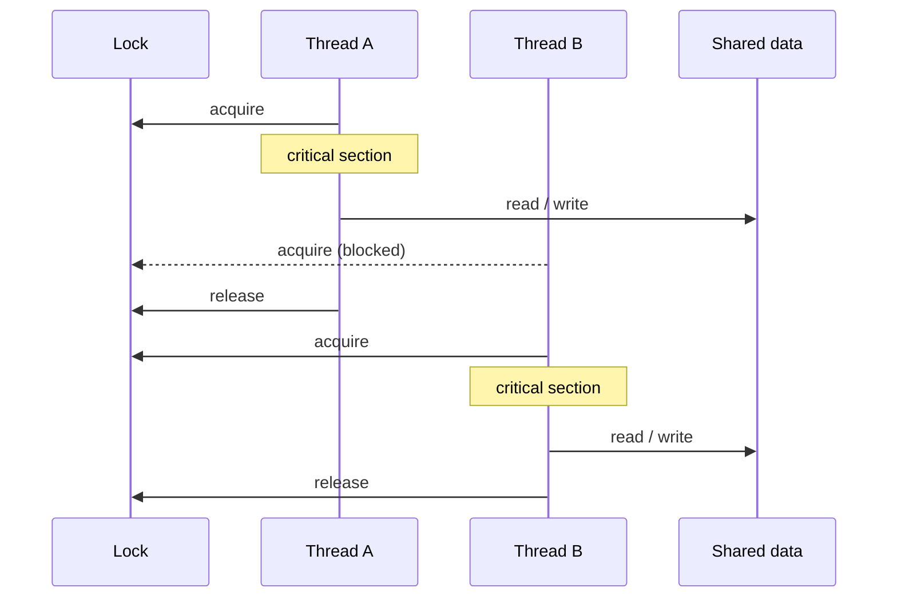
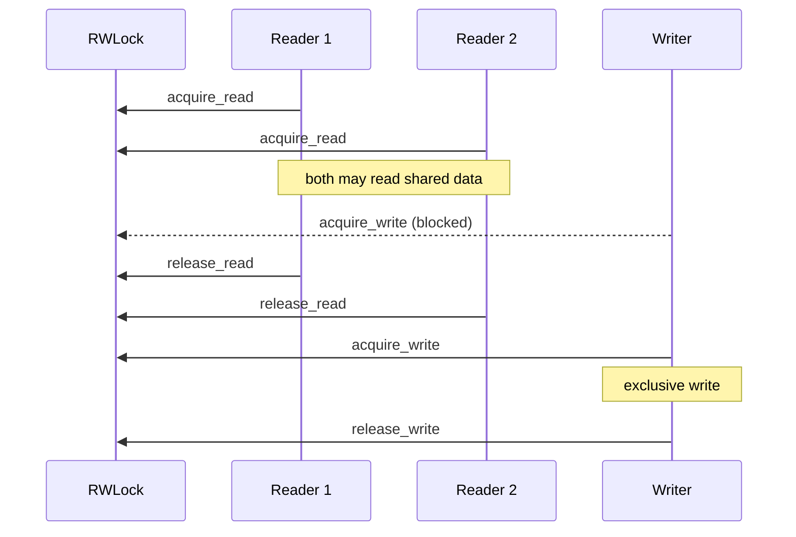
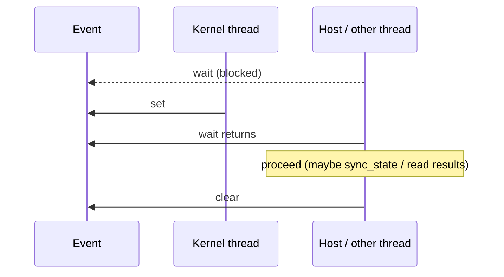
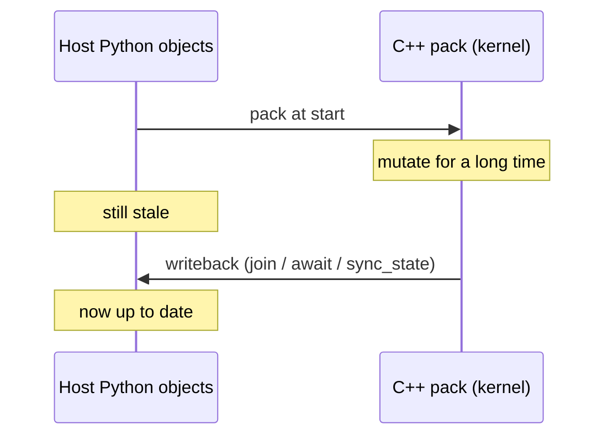
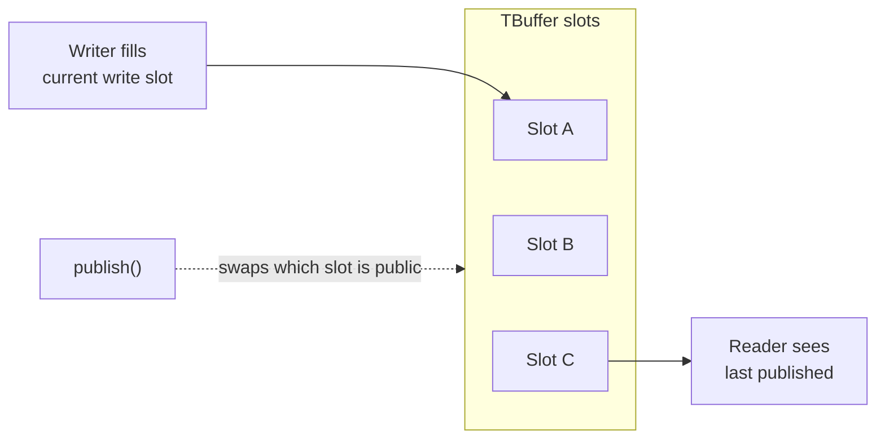

# cthreads.sync

# Contents


<!-- @import "[TOC]" {cmd="toc" depthFrom=1 depthTo=6 orderedList=false} -->

<!-- code_chunk_output -->

- [cthreads.sync](#cthreadssync)
- [Contents](#contents)
- [Why sync?](#why-sync)
- [Locks](#locks)
  - [Race conditions (why locks exist)](#race-conditions-why-locks-exist)
  - [What a lock does](#what-a-lock-does)
  - [Using `cthreads.sync.Lock`](#using-cthreadssynclock)
  - [RWLock](#rwlock)
  - [Event](#event)
- [State synchronization](#state-synchronization)
  - [Why we need state sync](#why-we-need-state-sync)
  - [Sync state from threads (`__sync_state()`)](#sync-state-from-threads-__sync_state)
  - [Request state sync from jobs (`job.sync_state()`)](#request-state-sync-from-jobs-jobsync_state)
  - [The high performance non-blocking alternative (`TBuffer`)](#the-high-performance-non-blocking-alternative-tbuffer)
    - [What problem it solves](#what-problem-it-solves)
    - [How you use it (application level)](#how-you-use-it-application-level)
    - [When to prefer which tool](#when-to-prefer-which-tool)
  - [See also](#see-also)

<!-- /code_chunk_output -->


# Why sync?

*Q: why do we need this?*  
*A:* `cthreads.sync` covers two common multithreading needs:

1. **Safe shared access** through locks (`Lock`, `RWLock`, `Event`, …)
2. **Updating Python-side object state** from a running kernel so the main thread sees data at chosen points (or on request)

Kernels run off the GIL on a C++ pack. Without sync tools, two jobs can corrupt shared data, and the host can read stale Python objects mid-run. See [concepts](../concepts.md) for the pack / writeback model, and [sync_state_docs](../sync_state_docs.md) for mid-run writeback details.

# Locks


## Race conditions (why locks exist)

A **race condition** happens when two or more threads touch the same shared data and the outcome depends on timing. Classic failure modes:

- **Lost update:** both threads read `x`, both add 1, both write; one increment vanishes.
- **Torn read:** one thread reads while another is halfway through a write; you see a mix of old and new fields.
- **Use-after-inconsistent:** thread A assumes a list length that thread B already changed.

In cthreads this shows up when several jobs share a `@Threadable`, `list`, or `dict` (or when the host reads those objects while a job still mutates the pack and writeback has not run yet). Locks do **not** replace writeback; they serialize who may enter a **critical section** that touches shared state.

## What a lock does

A `Lock` is a mutual-exclusion mutex. At most one thread holds it. Others block on `acquire` until the holder calls `release`. Wrap every read/write pair that must look atomic to other threads inside that critical section.




Without the lock, A and B could interleave on `D` and hit a race. With the lock, their critical sections run one after another (same idea as the GIL diagram, but you choose *which* shared work is exclusive).

## Using `cthreads.sync.Lock`

Create the lock on the host, pass it into `@Thread` kernels (typed), and call methods inside the kernel (or on the host if you also protect host-side access to the same object):


| Method          | Role                                                 |
| --------------- | ---------------------------------------------------- |
| `acquire()`     | Block until the lock is free, then take it           |
| `release()`     | Drop the lock so waiters can proceed                 |
| `try_acquire()` | Take it if free; return whether you got it (no wait) |


**Example:** two jobs bump a shared `@Threadable` counter under one lock.

```python
import cthreads
from cthreads import Thread, Threadable
from cthreads.sync import Lock

@Threadable
class Counter:
    value: int

@Thread
def bump(counter: Counter, lock: Lock, n: int) -> None:
    for i in range(n):
        lock.acquire()
        counter.value += 1
        lock.release()

lock = Lock()
counter = Counter()
counter.value = 0

j1 = cthreads.thread(bump, counter, lock, 1000)
j2 = cthreads.thread(bump, counter, lock, 1000)
j1.join()
j2.join()
# after join writeback, counter.value should be 2000
print(counter.value)
```

**Practices:**

- Hold the lock only for the short critical section, not for the whole heavy compute if you can avoid it.
- Always `release` on every path that acquired (including early returns). Prefer a clear acquire/release pair over long nested control flow.
- One shared object -> one lock that all writers/readers of that object agree on. Two locks on the same data without a fixed order invites **deadlocks** (A holds L1 waits for L2; B holds L2 waits for L1).
- Locks coordinate concurrent accessors. Mid-run **visibility on the Python host** still needs `job.sync_state()` / `__sync_state()` or join/await writeback ([sync_state_docs](../sync_state_docs.md)).


## RWLock

A **readers-writer lock** (`RWLock`) allows many threads to hold a **read** lock at once, but a **write** lock is exclusive (no other readers or writers). Use it when shared data is read often and updated rarely: readers do not block each other, so throughput stays higher than with a plain `Lock`.




| Method                                | Role                       |
| ------------------------------------- | -------------------------- |
| `acquire_read()` / `release_read()`   | Shared read access         |
| `try_acquire_read()`                  | Non-blocking read attempt  |
| `acquire_write()` / `release_write()` | Exclusive write access     |
| `try_acquire_write()`                 | Non-blocking write attempt |


**Example:**

```python
import cthreads
from cthreads import Thread, Threadable
from cthreads.sync import RWLock

@Threadable
class Config:
    scale: float

@Thread
def read_scale(cfg: Config, rw: RWLock) -> float:
    rw.acquire_read()
    s: float = cfg.scale
    rw.release_read()
    return s

@Thread
def set_scale(cfg: Config, rw: RWLock, value: float) -> None:
    rw.acquire_write()
    cfg.scale = value
    rw.release_write()

rw = RWLock()
cfg = Config()
cfg.scale = 1.0

# many readers can overlap; a writer waits until readers finish
j_r = cthreads.thread(read_scale, cfg, rw)
j_w = cthreads.thread(set_scale, cfg, rw, 2.5)
j_r.join()
j_w.join()
print(j_r.result())
print(cfg.scale)
```

**Practices:**

- Prefer `RWLock` when reads dominate; prefer plain `Lock` when almost every access writes.
- Do not upgrade read -> write while still holding the read lock (deadlock risk). Release the read lock first, then acquire write.
- Match every `acquire_*` with the matching `release_*`.


## Event

An `Event` is a thread-safe flag for **signaling**, not for protecting data. One side `set()`s when something happened; another side `wait()`s until that signal (or `wait_for(seconds)` with a timeout). Use it to wake a worker, announce "frame ready", or let the host wait until a kernel reaches a milestone.




| Method              | Role                                          |
| ------------------- | --------------------------------------------- |
| `set()`             | Signal: wake waiters; `is_set()` becomes true |
| `clear()`           | Reset the flag                                |
| `is_set()`          | Non-blocking check                            |
| `wait()`            | Block until set                               |
| `wait_for(seconds)` | Block until set or timeout (seconds as float) |


**Example:** kernel signals when a phase is done; host waits then reads state.

```python
import cthreads
from cthreads import Thread, Threadable
from cthreads.sync import Event

@Threadable
class Work:
    done_steps: int

@Thread
def run_phase(work: Work, ready: Event, steps: int) -> None:
    for i in range(steps):
        work.done_steps += 1
    ready.set()

ready = Event()
work = Work()
work.done_steps = 0

job = cthreads.thread(run_phase, work, ready, 100)
ready.wait()          # host blocks until kernel signals
job.sync_state()      # optional: pull pack into Python before join
print(work.done_steps)
job.join()
```

**Practices:**

- `Event` does not protect shared memory by itself. If host and kernel both touch the same fields, still use a `Lock` / `RWLock` and/or writeback rules.
- After `wait`, call `clear()` if you need to reuse the same event for a later signal.
- Prefer `wait_for` when the host must stay responsive or recover from a stuck worker.


# State synchronization

## Why we need state sync

Locks stop two kernels from stomping the same data at once. They do **not** make the Python main thread see live C++ memory.

When you call `cthreads.thread(fn, args...)`, mutable args are **packed** (copied) into a C++ pack. The kernel edits that pack off the GIL. Until writeback runs, Python still holds the old snapshot:



You need state sync when:

* a job runs for a long time (simulation, render loop) and the UI must show progress **before** `join`
* the host polls a `@Threadable` / `list` / `dict` that the kernel keeps updating
* you want an explicit checkpoint inside the kernel after a phase finishes

**Automatic writeback** still happens on `join` / `await`. Mid-run sync is the extra tool for visibility *during* the job.

| Tool | Who calls it | Typical use |
|---|---|---|
| `__sync_state()` | Inside `@Thread` | Kernel pushes pack -> Python at a safe point |
| `job.sync_state()` | Host Python | Host pulls pack -> Python while the job runs |
| `TBuffer` | Kernel publishes; host/UI reads | High-rate frames without stopping the producer on every GUI tick |

Deep internals (bridge, TLS, by-ref packs): [sync_state_docs.md](../sync_state_docs.md).

## Sync state from threads (`__sync_state()`)

`__sync_state()` is a **kernel barrier**. Codegen turns it into a native call that copies the job's mutable pack args back into the Python objects that were passed to `thread` / `spawn`.

* Import it so the name resolves: `from cthreads import __sync_state`
* Only valid **inside** `@Thread` bodies. Calling it as normal Python raises
* It is a full snapshot of those mutable args (not a field-level diff)
* It can block briefly while writeback runs under the job's state lock + GIL

```python
import cthreads
from cthreads import Thread, Threadable, __sync_state

@Threadable
class Sim:
    step: int

@Thread
def run_forever(sim: Sim, pulses: int) -> None:
    for i in range(pulses):
        sim.step += 1
        if i % 100 == 0:
            __sync_state()  # host can now read sim.step mid-run

sim = Sim()
sim.step = 0
job = cthreads.thread(run_forever, sim, 10_000)
job.start()
# host may poll sim.step after the kernel hits __sync_state
job.join()
print(sim.step)
```

**When to use it:** the kernel knows the safe points (end of frame, end of phase). Prefer this if the worker should drive how often the host sees updates.

## Request state sync from jobs (`job.sync_state()`)

Same writeback, started from the **host**. Useful when the UI or control loop decides the poll rate.

```python
import cthreads
from cthreads import Thread, Threadable

@Threadable
class Sim:
    step: int

@Thread
def run_forever(sim: Sim, pulses: int) -> None:
    for i in range(pulses):
        sim.step += 1

sim = Sim()
sim.step = 0
job = cthreads.thread(run_forever, sim, 10_000)
job.start()
while not job.done():
    job.sync_state()          # or cthreads.sync_state(job)
    # read sim.step for UI / logs
    ...
job.join()
```

**Notes:**

* The job must already be **started**
* No-op once the kernel has finished (final writeback already ran on join)
* Updates only the Python objects that were **job args**, not random aliases
* If two jobs share one Python list/Threadable, last writeback wins

**`__sync_state` vs `job.sync_state`:** same copy direction (pack -> Python). Kernel-driven vs host-driven timing. You can use both in one app (kernel checkpoints + host UI poll).

## The high performance non-blocking alternative (`TBuffer`)

### What problem it solves

`sync_state` is a **full snapshot** of mutable job args into Python. That is simple and correct, but at high rates (many frames/syncs per second) it costs GIL time and often copies more than a renderer/application needs.

A **`TBuffer`** is a fixed-capacity **triple buffer** for streaming data:

* the producer fills one internal slot
* `publish()` makes that slot the one consumers read
* the producer switches to another slot for the next frame

Readers see a **stable published snapshot** without waiting for the writer to finish the next frame.

User mental model (you do not need the atomic details):



* Writer and reader usually avoid a big lock around the whole frame
* Capacity is the number of elements **per slot** (for example N particles). You pass `capacity=N`; the buffer keeps three internal copies behind the scenes

### How you use it (application level)

1. Annotate a kernel parameter as `TBuffer[YourThreadable]` (scalar buffer helpers also exist on `cthreads.sync` for some primitive layouts).
2. On the host, allocate with `create_tbuffer(YourThreadable, capacity)` after kernels are built and loaded, then pass the handle into the job.
3. In the kernel: index into the buffer (`buf[i].field = ...` writes the **current write slot**), then `buf.publish()` when a frame is ready. Optional helpers: `read_at(i)`, `generation()`, `capacity()`.
4. On the host / UI: poll `tbuffer_generation(handle)` (or an `Event`), then take a published snapshot for drawing. Do not rely on per-tick `sync_state` of every element if TBuffer is your frame path.

Sketch:

```python
import cthreads
from cthreads import Thread, Threadable
from cthreads.types import TBuffer
from cthreads.sync import create_tbuffer, tbuffer_generation

@Threadable
class Particle:
    x: float
    y: float

@Thread
def simulate(buf: TBuffer[Particle], n: int, steps: int) -> None:
    for s in range(steps):
        for i in range(n):
            buf[i].x = float(i)   # write slot only
            buf[i].y = float(s)
        buf.publish()             # flip: readers see this frame

# after compile / load_kernels:
handle = create_tbuffer(Particle, capacity=1024)
job = cthreads.thread(simulate, handle, 1024, 1000)
job.start()
last = -1
while not job.done():
    gen = tbuffer_generation(handle)
    if gen != last:
        last = gen
        # pull / draw published frame (see sync APIs for read-copy helpers)
        ...
job.join()
handle.destroy()
```

### When to prefer which tool

| Goal | Prefer |
|---|---|
| Occasional progress / debug mid-run | `__sync_state` or `job.sync_state` |
| Host-driven UI poll on Threadables/lists | `job.sync_state` |
| High-rate simulation -> renderer frames | `TBuffer` |
| Mutual exclusion on shared mutables | `Lock` / `RWLock` (orthogonal to writeback) |

**Practices:**

* `TBuffer` is for **streaming snapshots**, not a replacement for locks on arbitrary shared Python objects.
* Destroy handles you create (`handle.destroy()` / `destroy_tbuffer`) when finished.
* Rebuild and reload kernels after you first introduce `TBuffer[SomeType]` so the create/destroy symbols exist.

## See also

* [concepts.md](../concepts.md) - pack / writeback overview
* [sync_state_docs.md](../sync_state_docs.md) - bridge, TLS, by-ref packs
* [math_and_linalg.md](./math_and_linalg.md) - arrays (separate from TBuffer)
