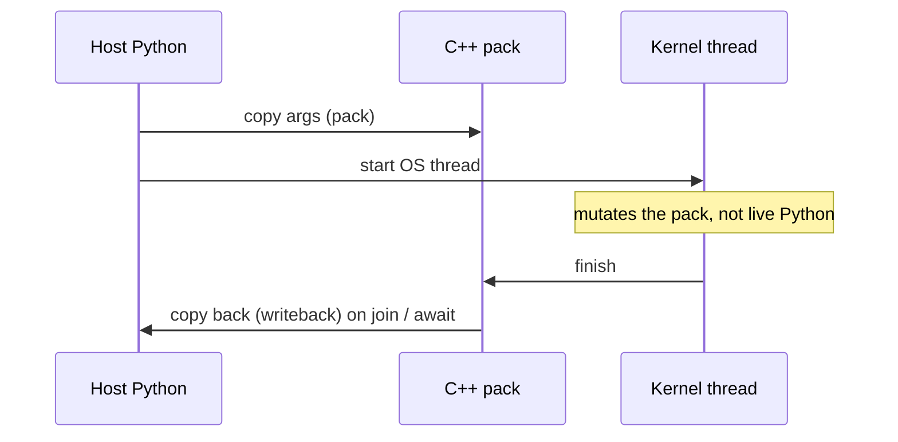

# `@Thread` and `@Threadable`

cthreads does not run your annotated functions as normal Python on a `threading.Thread`. It **translates** them to C++, compiles them, and runs that native code on a real OS thread **off the GIL**.

Two decorators mark what should be compiled:

- **`@Thread`** - a function or method that becomes a C++ kernel
- **`@Threadable`** - a class that becomes a C++ struct (fixed fields, plus optional `@Thread` methods)

This guide is the rule book for those two. For starting / waiting / results, see [jobs.md](./jobs.md). For locks and mid-run Python updates, see [sync.md](./sync.md).

# Contents

<!-- @import "[TOC]" {cmd="toc" depthFrom=1 depthTo=6 orderedList=false} -->

<!-- code_chunk_output -->

- [`@Thread` and `@Threadable`](#thread-and-threadable)
- [Contents](#contents)
- [Why two decorators?](#why-two-decorators)
- [How a call actually runs](#how-a-call-actually-runs)
- [Allowed types](#allowed-types)
- [`@Thread` - functions that become kernels](#thread---functions-that-become-kernels)
  - [Rules](#rules)
  - [Locals](#locals)
  - [What you may write in the body](#what-you-may-write-in-the-body)
  - [What you may call](#what-you-may-call)
- [`@Threadable` - classes that become structs](#threadable---classes-that-become-structs)
  - [Fields](#fields)
  - [Default constructor](#default-constructor)
  - [Methods](#methods)
  - [Nesting and lists of Threadables](#nesting-and-lists-of-threadables)
- [Launching work](#launching-work)
- [Common mistakes](#common-mistakes)
- [See also](#see-also)

<!-- /code_chunk_output -->

# Why two decorators?

Python objects can grow new attributes at any time. C++ structs cannot. The compiler needs a **fixed layout**: every field name and type known up front.

`@Threadable` is that contract for data. `@Thread` is that contract for code.

Typical split:

- Host Python: create objects, start jobs, talk to the UI / files / network
- `@Thread` kernels: tight loops, math, updates to Threadables and lists

Decorating does **not** compile yet. It only registers the function or class. Compilation happens on the first `cthreads.thread(...)` (or an explicit `prepare()`).

Calling an `@Thread` function as normal Python still runs the **Python** body (GIL and all). That is fine for a quick check. Off-GIL speed only happens through `cthreads.thread(...)` (or a pool submit).

# How a call actually runs



Mutable args (`list`, `dict`, `@Threadable`) are copied into the pack at start. The kernel edits that copy. Python objects stay at the launch snapshot until **writeback**:

- automatic on `join` / `await`
- optional mid-run with `job.sync_state()` or `__sync_state()` inside the kernel

Scalars (`int`, `float`, `bool`, `str`) are not updated in-place on the host. **Return** the new value if you need it.

Writeback only updates the Python objects you passed as **job arguments**, not some other variable that happens to point at similar data.

# Allowed types

Every type in this list is allowed on `@Thread` parameters, returns, locals, and `@Threadable` fields. Anything else is rejected.

| You write | Rough C++ | Notes |
|---|---|---|
| `int` | `int` | |
| `float` | `double` | Python `float` is always a C++ `double` here |
| `bool` | `bool` | |
| `str` | `std::string` | |
| `list[T]` | `std::vector<T>` | `T` must itself be allowed |
| `dict[K, V]` | `std::unordered_map<K, V>` | keys are usually `str` or `int` |
| `@Threadable` class | generated `struct` | nestable |
| `cthreads.sync` types | native C++ | `Lock`, `Event`, `RWLock`, `TBuffer[...]` |
| `cthreads.linalg` arrays | native C++ | see [math_and_linalg.md](./math_and_linalg.md) |

This is a **whitelist**, not "whatever Python accepts".

**Not supported (yet):** `set[...]` (it may pass the decorator check, but codegen will not), `Any`, untyped values, NumPy arrays as kernel types, random user classes that are not `@Threadable`.

Nesting is fine: `list[Particle]`, `dict[str, list[float]]`, a Threadable that contains another Threadable.

# `@Thread` - functions that become kernels

```python
from cthreads import Thread

@Thread
def add(a: int, b: int) -> int:
    return a + b
```

Free functions (module-level) become C++ functions. Methods on a `@Threadable` become C++ member functions. Same decorator for both.

## Rules

1. **Every parameter is typed.** No skipped hints.
2. **There is a return type.** Use `-> None` when the function does not return a value.
3. **No `*args` / `**kwargs`.** The C++ signature is fixed.
4. **New locals use annotated assignment:** `total: float = 0.0`, not `total = 0.0`.
5. **The body is a Python subset** (next sections). No `try` / `with` / arbitrary imports inside the kernel.
6. **Calls are whitelisted.** Other `@Thread` functions/methods, `math`, `cthreads.math`, `cthreads.sync`, `cthreads.linalg`, `len`, `range`, `__sync_state`, plus list/dict methods on typed containers.

```python
from cthreads import Thread

@Thread
def scale(xs: list[float], factor: float) -> float:
    total: float = 0.0
    n: int = len(xs)
    for i in range(n):
        xs[i] = xs[i] * factor
        total += xs[i]
    return total
```

## Locals

The compiler does not guess types from the right-hand side the way a human does. It records a type when a name is **introduced**:

- a parameter
- `name: Type = value`
- a `for i in range(...)` loop variable (treated as `int`)
- a `for item in xs:` loop variable (treated as the list element type)

After that, `name = ...` and `name += ...` are allowed. First assignment without a type is an error:

```python
@Thread
def bad(n: int) -> float:
    s = 0.0          # error: unknown name / missing annotation
    return s
```

Loop variables from `for` are scoped to that loop. Do not reuse the same name as an existing local.

## What you may write in the body

**Control flow:** `if` / `else`, `while`, `for`, `break`, `continue`, `pass`, `return`. No `for/else` or `while/else`. No `try` / `except` / `raise` / `with` / `del`.

**Loops:**

```python
for i in range(n):          # 1, 2, or 3 args; step is assumed positive
    ...
for item in xs:             # xs must be a list[...] name (or expression the compiler can type as a list)
    ...
```

**Math and logic:** `+ - * / % **`, bitwise ops, `and` / `or` / `not`, comparisons including chains (`a < b < c`).

**Reads:** names, `obj.field`, `xs[i]`, `d[k]` (no slices like `xs[1:3]`).

**Writes:** `name = ...`, `obj.field = ...`, `xs[i] = ...`, `d[k] = ...`, and the same with `+=` and friends.

On a `dict`, `d[k]` for a missing key **inserts** a default value (C++ map `operator[]`). Use `d.get(k, default)` when you only want a fallback.

## What you may call

**Other kernels**

```python
@Thread
def step_one(p: Particle, dt: float) -> None:
    p.x += p.vx * dt

@Thread
def step_all(ps: list[Particle], n: int, dt: float) -> None:
    for i in range(n):
        ps[i].step(dt)      # @Thread method on a Threadable
        # or: step_one(ps[i], dt)  if step_one is also @Thread
```

`ps[i].move(noise)` is a C++ member call. The method must exist on that Threadable.

**Builtins:** `len(xs)` (on a TBuffer this is capacity), `range(...)`, `__sync_state()` (no arguments; kernel-only writeback barrier).

**List / dict** (typed receiver):

| Type | Method | Notes |
|---|---|---|
| `list` | `append`, `extend`, `insert`, `pop`, `clear` | `pop()` or `pop(i)` |
| `dict` | `get`, `pop`, `clear` | `get` and `pop` **require a default** (no `None`) |

No keyword arguments on these methods (`xs.append(x=1)` is rejected).

**Libraries:** `import math` (or `from math import sqrt`) for `sqrt`, `sin`, `pi`, and other names that exist on stdlib `math`. `from cthreads import math as cm` for `abs`, `min`, `max`, `clamp`, `uniform`, `randint`, `random`, `seed`. Sync and linalg APIs: [sync.md](./sync.md), [math_and_linalg.md](./math_and_linalg.md).

Anything else (`print`, `random.random`, a helper you forgot to decorate) fails at translate time with `unsupported call`.

# `@Threadable` - classes that become structs

Python classes are open. The compiler needs a closed struct. `@Threadable` means: these fields, these types, no surprise attributes later.

```python
from cthreads import Threadable, Thread

@Threadable
class Particle:
    x: float
    y: float
    vx: float
```

## Fields

- Declare every field at **class** scope with a type: `x: float`.
- Only allowed types (table above).
- Nested Threadables and `list[SomeThreadable]` are allowed. Self-reference in a list usually needs `from __future__ import annotations` or a quoted name (`list["Boid"]`).
- Do not add attributes later in Python (`p.extra = 1`) and expect the kernel to see them. The struct has no such member.

## Constructor

Do **not** write your own `__init__`. The decorator rejects it and supplies a dataclass-style constructor: fields in declaration order, positional or keyword, omitted fields match C++ `T{}`:

- `int` -> `0`
- `float` -> `0.0`
- `bool` -> `False`
- `str` -> `""`
- `list[...]` -> `[]`
- `dict[...]` -> `{}`
- nested `@Threadable` -> `ThatClass()`
- `Lock()` / other zero-arg cthreads types -> `Type()`

```python
p = Particle()                 # x, y, vx are 0.0
p = Particle(1.0, 2.0, 0.0)    # positional, field order
p = Particle(x=1.0, vx=1.5)    # keywords; y stays 0.0
```

This is host Python only. Kernels still construct with `Particle()` / C++ `Name() = default` (`double x{};`). Do not call `Particle(1.0, 2.0)` inside `@Thread`.

## Methods

Kernel methods use `@Thread` and a normal `self`:

```python
@Threadable
class Particle:
    x: float
    vx: float

    @Thread
    def step(self, dt: float) -> None:
        self.x += self.vx * dt
```

Plain (non-`@Thread`) methods are not compiled. Keep host-only helpers off the class, or accept that they never become kernels.

**Three ways to run a method:**

1. **As a job** - pass the unbound function and the instance as `self`:

   ```python
   job = cthreads.thread(Particle.step, p, 0.016)
   job.join()
   ```

   `cthreads.thread(p.step, 0.016)` is wrong: bind would miss `self`.

2. **From another kernel** - `ps[i].step(dt)` or `self.step(dt)` inside `@Thread` (see above).

3. **As normal Python** - `p.step(0.016)` runs the Python body, not the C++ kernel. Useful to debug logic; not the fast path.

## Nesting and lists of Threadables

```python
@Threadable
class Vec2:
    x: float
    y: float

@Threadable
class Boid:
    pos: Vec2
    vel: Vec2

@Thread
def kick(boids: list[Boid], n: int) -> None:
    for i in range(n):
        boids[i].pos.x += boids[i].vel.x
```

`Boid()` also default-constructs `pos` and `vel` as `Vec2()`. `Boid(Vec2(1.0, 0.0), Vec2(0.0, 1.0))` works on the host. A list field starts as `[]`; you still fill it from Python before `thread(...)`.

# Launching work

```python
import cthreads
from cthreads import Thread

@Thread
def work(n: int) -> int:
    s: int = 0
    for i in range(n):
        s += 1
    return s

job = cthreads.thread(work, 1_000_000)
job.join()
print(job.result())
```

- First `thread(...)` may compile and load `cthreads_kernels`. Later calls reuse the cache until you change annotated source.
- After source changes, `unload_kernels()` then `thread(..., force=True)` (or `prepare(force=True)` + `load_kernels`). On Windows you must unload before rebuilding a loaded DLL.
- Jobs, `await`, and mid-run sync: [jobs.md](./jobs.md).

# Common mistakes

| Mistake | What to do instead |
|---|---|
| `x = 0` as a new local | `x: int = 0` |
| Missing `-> None` | Always write a return type |
| Custom `__init__` on a Threadable | Forbidden; use the generated dataclass-style ctor |
| `Particle(1.0, 2.0)` inside `@Thread` | Host-only; in a kernel use `p: Particle = Particle()` then assign |
| `thread(p.step, dt)` | `thread(Particle.step, p, dt)` |
| `print(...)` or undecorated helpers in a kernel | Only the call whitelist |
| Reading `p.x` on the host during a run | `job.sync_state()` / `__sync_state()` / wait for `join` |
| Expecting `start += 1` on an `int` arg to change the Python int | Return the new value; ints are copied by value |
| `set[...]` in annotations | Not codegen-supported; use `list` |
| Tiny millisecond work in a job | Keep it on the host; spawn is cheap but not free |

# See also

- [concepts.md](../concepts.md) - GIL, pack / writeback overview
- [jobs.md](./jobs.md) - `Job`, `join`, `await`, `sync_state`
- [sync.md](./sync.md) - locks, `__sync_state`, `TBuffer`
- [math_and_linalg.md](./math_and_linalg.md) - arrays and math
- [install.md](../install.md) - compilers and first build
