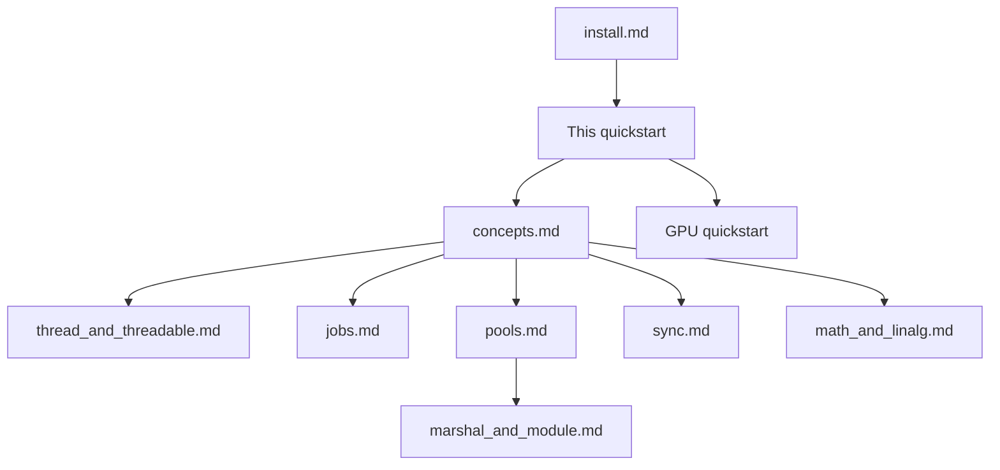

# CPU quickstart

This page is the linear start for CPU **cthreads**. You will learn the basic types, the `@Thread` and `@Threadable` decorators, how kernels are compiled, and how to launch work. After that, short sections point you at pools, sync, Shared values, and related tools.

Install first if needed: [install.md](./install.md). Pitfalls and package choice (`cthreads` vs `cthreads-gpu`): [FAQ.md](./FAQ.md).

A longer interactive demo (pool, Shared, and TBuffer) is in [Colab Mandelbrot](https://colab.research.google.com/github/K-T0BIAS/CThreads/blob/main/colab/Mandelbrot.ipynb).

---

## Reading map



1. [install.md](./install.md) - toolchain and `pip install`
2. **This page** - basics end to end
3. [concepts.md](./concepts.md) - GIL, pack, writeback rules
4. Then pick tools as you need them:
   - [thread_and_threadable.md](./guide/thread_and_threadable.md)
   - [jobs.md](./guide/jobs.md)
   - [pools.md](./guide/pools.md)
   - [sync.md](./guide/sync.md)
   - [marshal_and_module.md](./guide/marshal_and_module.md)
   - [math_and_linalg.md](./guide/math_and_linalg.md)
5. GPU track: [guide/gpu/quickstart.md](./guide/gpu/quickstart.md)

---

## What cthreads does on CPU

**cthreads** compiles a typed subset of your Python into C++. The compiled code runs on real operating-system threads. It does not hold the **GIL** (Global Interpreter Lock) while that native code runs. The GIL is the CPython lock that normally lets only one thread execute Python bytecode at a time.

You still write Python-shaped functions and call them through `cthreads.thread(...)` or a **ThreadPool**. The library keeps jobs, pools, and sync tools close to ordinary Python control flow.

---

## Allowed types

Every parameter, return value, and local inside a kernel needs an annotation from a fixed whitelist. That is required so the compiler can emit a fixed C++ layout.

Allowed building blocks:

- `int`, `float`, `bool`, `str`
- `list[...]` of allowed types
- `dict[...]` of allowed types (often `dict[str, ...]`)
- nested combinations of the above
- classes marked with `@Threadable`
- internal types from `cthreads` (for example sync helpers and linalg arrays)

This is a whitelist. Arbitrary Python objects are not allowed. Untyped values are not allowed.

```python
from cthreads import Thread

@Thread
def scale(xs: list[float], factor: float) -> None:
    # Locals need types as well as parameters.
    i: int = 0
    n: int = len(xs)
    while i < n:
        xs[i] = xs[i] * factor
        i = i + 1
```

More detail: [thread_and_threadable.md](./guide/thread_and_threadable.md).

---

## Decorators

### `@Thread`

Marks a function (or method) for compilation to a native kernel. Calling the function as ordinary Python still runs the Python body. Off-GIL execution happens when you launch through `cthreads.thread(...)` or a pool.

```python
from cthreads import Thread
import cthreads

@Thread
def add(a: int, b: int) -> int:
    s: int = a + b
    return s

# Launch off the GIL. join waits. result reads the return value.
job = cthreads.thread(add, 2, 3)
job.join()
print(job.result())  # 5
```

### `@Threadable`

Marks a class as a C++-backed struct for kernel state. Fields need annotations. Do not write a custom `__init__`. The generated constructor fills omitted fields with zeros or empties.

```python
from cthreads import Thread, Threadable
import cthreads

@Threadable
class Point:
    x: float
    y: float

@Thread
def move(p: Point, dx: float) -> None:
    p.x = p.x + dx

pt: Point = Point(1.0, 2.0)
cthreads.thread(move, pt, 0.5).join()
print(pt.x)  # 1.5 after writeback on join
```

---

## Pack and writeback

When a job starts, arguments are **packed**. Packing means copying them into a C++ argument block the kernel can mutate.

The kernel edits that pack. It does not edit live Python objects during the run (unless you use special sync tools).

On `join` (and on explicit sync), **writeback** copies mutable pack fields back into the Python objects you passed. That is why `pt.x` updates after `join` in the example above.

If you need updates while a job is still running, use the sync tools described later. See [concepts.md](./concepts.md).

---

## Compile and load

Kernels are not only decorated. They must be translated and linked into a shared library (for example `cthreads_kernels.dll` or `.so`).

### Automatic path

`cthreads.thread(...)` can run a cache-checked compile and load when no kernel library is loaded yet. The first call can take noticeable time. Later calls reuse the cache when the annotated source is unchanged.

```python
import cthreads
from cthreads import Thread

@Thread
def add(a: int, b: int) -> int:
    return a + b

# May compile on first use. Warm up before you benchmark.
cthreads.thread(add, 1, 1).join()
```

### Explicit path (required for ThreadPool)

A **ThreadPool** does not auto-compile for you. Call `prepare()` then `load_kernels(...)` before `submit` or `group`.

```python
from cthreads import Thread, ThreadPool, prepare, load_kernels

@Thread
def add(a: int, b: int) -> int:
    return a + b

# prepare: codegen + native link. load_kernels: map the library into this process.
binary = prepare()
load_kernels(str(binary))

pool = ThreadPool(4).start()
try:
    print(pool.submit(add, 1, 2).result())  # 3
finally:
    pool.stop()
```

`prepare(force=True)` rebuilds even when the cache looks fresh. If a library is already loaded on Windows, unload it first with `unload_kernels()` before a force rebuild.

---

## Jobs in one sentence

A **Job** is the handle for one launched piece of work. You can `join()`, `await` it in async code, and read `result()` after it finishes. Details: [jobs.md](./guide/jobs.md).

---

## Specialized tools (short map)

Read these when the basics above are clear. Each link is the full guide.

### ThreadPool

A **ThreadPool** is a fixed set of worker threads that run many `@Thread` jobs without starting one OS thread per job. Use `pool.group(...)` or `submit_queue` when jobs share `Shared[...]` state so the shared host stays alive for the whole wave.

Guide: [pools.md](./guide/pools.md).

### Shared values

`Shared[T]` marks a value that many jobs should see as one native object (for example one shared list). Plain `list` arguments are packed per job. They do not automatically share mutations across jobs.

Guide: [marshal_and_module.md](./guide/marshal_and_module.md) and the Shared sections in [pools.md](./guide/pools.md).

### Sync, locks, and TBuffer

**Locks** and **events** coordinate threads that touch shared data. A **TBuffer** is a fixed-capacity native triple buffer. It is useful when many workers write into one buffer and you want publish / read snapshots without writing every element back through Python list marshal.

Guide: [sync.md](./guide/sync.md).

### Math and linalg

Use `math`, `cthreads.math`, and `cthreads.linalg` arrays inside kernels when you need numeric helpers beyond raw loops.

Guide: [math_and_linalg.md](./guide/math_and_linalg.md).

### GPU

The same product line can compile `@Gpu` kernels to Vulkan compute (SPIR-V). That needs `pip install cthreads-gpu` (not the CPU-only package). Start at the [GPU quickstart](./guide/gpu/quickstart.md).

---

## Next step

Read [concepts.md](./concepts.md) next. It expands the GIL story, the pack model, and the hard rules with more motivation. Keep this quickstart open as a checklist while you try small kernels locally or in Colab.
